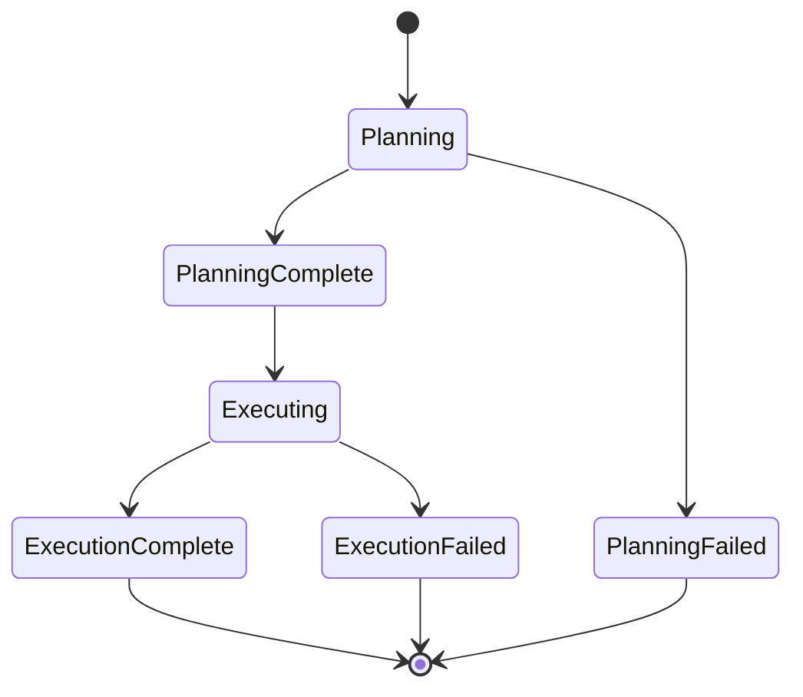
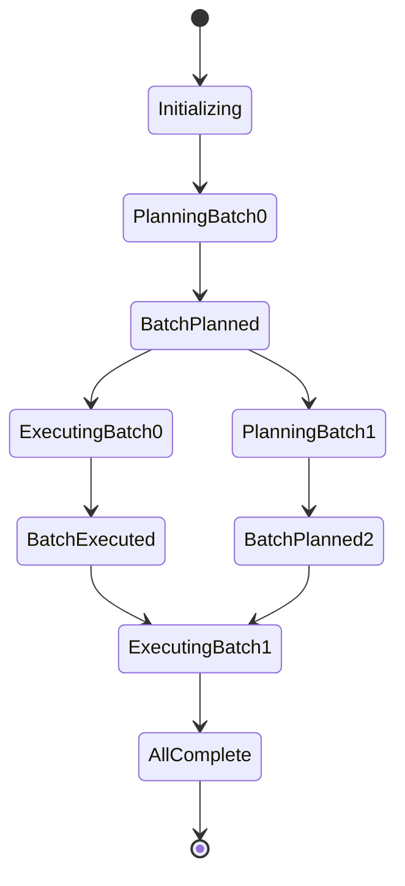
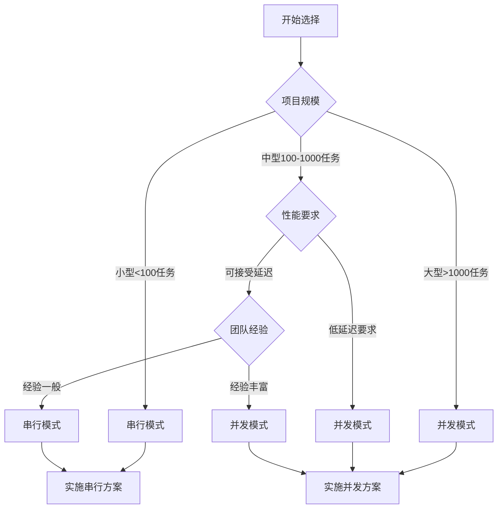

# Agent协作模式架构对比与最佳实践

## 1. 架构模式深度对比

### 1.1 执行时序对比

#### 串行模式时序图

```mermaid
gantt
    title 串行模式执行时序
    dateFormat X
    axisFormat %s
    
    section PlanAgent
    规划Batch0    :0, 2
    规划Batch1    :2, 4
    规划Batch2    :4, 6
    规划完成通知  :6, 7
    
    section TestAgent
    等待规划完成  :0, 7
    执行Batch0    :7, 9
    执行Batch1    :9, 11
    执行Batch2    :11, 13
```


#### 并发模式时序图

```mermaid
gantt
    title 并发模式执行时序
    dateFormat X
    axisFormat %s
    
    section PlanAgent
    规划Batch0    :0, 2
    规划Batch1    :2, 4
    规划Batch2    :4, 6
    
    section TestAgent
    执行Batch0    :2, 4
    执行Batch1    :4, 6
    执行Batch2    :6, 8
```


### 1.2 性能指标对比

| 指标 | 串行模式 | 并发模式 | 改进幅度 |
|------|----------|----------|----------|
| 总执行时间 | T_plan + T_exec | max(T_plan, T_exec) | ~40-60% |
| 内存使用 | 低 | 中等 | +20-30% |
| CPU利用率 | 50% | 80-90% | +60-80% |
| 复杂度 | 低 | 高 | +200% |
| 错误率 | 低 | 中等 | +50% |

### 1.3 状态管理对比

#### 串行模式状态流


#### 并发模式状态流


## 2. 技术实现细节

### 2.1 数据一致性保证

#### 串行模式
```typescript
// 简单的状态检查
class SerialModeValidator {
    async validateState(threadId: string): Promise<boolean> {
        const planState = await this.getPlanState(threadId);
        const execState = await this.getExecState(threadId);
        
        // 串行模式：执行只能在规划完成后开始
        return !execState.started || planState.completed;
    }
}
```

#### 并发模式
```typescript
// 复杂的状态同步机制
class ConcurrentModeValidator {
    async validateBatchConsistency(threadId: string, batchIndex: number): Promise<boolean> {
        const batchState = await this.getBatchState(threadId, batchIndex);
        const planEvent = await this.getPlanEvent(threadId, batchIndex);
        const execEvent = await this.getExecEvent(threadId, batchIndex);
        
        // 并发模式：执行只能在对应批次规划完成后开始
        if (execEvent && !planEvent) {
            throw new Error(`Batch ${batchIndex} execution started before planning completed`);
        }
        
        // 检查批次顺序
        if (batchIndex > 0) {
            const prevBatchState = await this.getBatchState(threadId, batchIndex - 1);
            if (!prevBatchState || prevBatchState.status === 'planning') {
                console.warn(`Batch ${batchIndex} may be out of order`);
            }
        }
        
        return true;
    }
    
    async repairInconsistentState(threadId: string): Promise<void> {
        const allBatches = await this.getAllBatchStates(threadId);
        const events = await this.getAllEvents(threadId);
        
        for (const batch of allBatches) {
            const planEvent = events.find(e => 
                e.type === 'BATCH_PLANNED' && e.batchIndex === batch.batchIndex
            );
            const execEvent = events.find(e => 
                e.type === 'BATCH_EXECUTED' && e.batchIndex === batch.batchIndex
            );
            
            // 修复不一致状态
            if (execEvent && !planEvent) {
                // 补充缺失的规划事件
                await this.createMissingPlanEvent(threadId, batch.batchIndex);
            }
        }
    }
}
```

### 2.2 错误处理策略

#### 串行模式错误处理
```typescript
class SerialErrorHandler {
    async handlePlanningError(error: Error, threadId: string): Promise<void> {
        console.error(`[SerialMode] Planning failed for ${threadId}:`, error);
        
        // 简单重试机制
        const retryCount = await this.getRetryCount(threadId, 'planning');
        if (retryCount < 3) {
            await this.incrementRetryCount(threadId, 'planning');
            await this.resetPlanningState(threadId);
            throw new Error('Planning failed, will retry');
        } else {
            await this.markAsFailed(threadId, 'planning', error);
            throw new Error('Planning failed after max retries');
        }
    }
    
    async handleExecutionError(error: Error, threadId: string): Promise<void> {
        console.error(`[SerialMode] Execution failed for ${threadId}:`, error);
        
        // 执行失败时，可以选择重新规划或直接失败
        const planState = await this.getPlanState(threadId);
        if (planState.canReplan) {
            await this.resetToPlanning(threadId);
        } else {
            await this.markAsFailed(threadId, 'execution', error);
        }
    }
}
```

#### 并发模式错误处理
```typescript
class ConcurrentErrorHandler {
    async handleBatchPlanningError(error: Error, threadId: string, batchIndex: number): Promise<void> {
        console.error(`[ConcurrentMode] Batch ${batchIndex} planning failed:`, error);
        
        // 标记当前批次失败
        await this.markBatchFailed(threadId, batchIndex, 'planning', error);
        
        // 检查是否影响后续批次
        const dependentBatches = await this.getDependentBatches(threadId, batchIndex);
        for (const depBatch of dependentBatches) {
            await this.pauseBatchExecution(threadId, depBatch);
        }
        
        // 尝试恢复策略
        await this.attemptBatchRecovery(threadId, batchIndex);
    }
    
    async handleBatchExecutionError(error: Error, threadId: string, batchIndex: number): Promise<void> {
        console.error(`[ConcurrentMode] Batch ${batchIndex} execution failed:`, error);
        
        // 获取执行进度
        const execProgress = await this.getBatchExecutionProgress(threadId, batchIndex);
        
        if (execProgress.completedTasks > 0) {
            // 部分任务已完成，尝试从失败点恢复
            await this.resumeFromFailurePoint(threadId, batchIndex, execProgress);
        } else {
            // 整个批次失败，标记并继续其他批次
            await this.markBatchFailed(threadId, batchIndex, 'execution', error);
            await this.continueOtherBatches(threadId, batchIndex);
        }
    }
    
    private async attemptBatchRecovery(threadId: string, batchIndex: number): Promise<void> {
        const recoveryStrategies = [
            () => this.retryBatchPlanning(threadId, batchIndex),
            () => this.skipBatchAndContinue(threadId, batchIndex),
            () => this.mergeBatchWithNext(threadId, batchIndex)
        ];
        
        for (const strategy of recoveryStrategies) {
            try {
                await strategy();
                console.log(`[Recovery] Batch ${batchIndex} recovered successfully`);
                return;
            } catch (recoveryError) {
                console.warn(`[Recovery] Strategy failed for batch ${batchIndex}:`, recoveryError);
            }
        }
        
        console.error(`[Recovery] All recovery strategies failed for batch ${batchIndex}`);
    }
}
```

### 2.3 性能优化策略

#### 并发模式优化
```typescript
class ConcurrentOptimizer {
    // 动态批次大小调整
    async optimizeBatchSize(threadId: string, currentPerformance: PerformanceMetrics): Promise<number> {
        const historicalData = await this.getHistoricalPerformance(threadId);
        const avgPlanTime = historicalData.avgPlanningTime;
        const avgExecTime = historicalData.avgExecutionTime;
        
        // 根据规划和执行时间比例调整批次大小
        const ratio = avgExecTime / avgPlanTime;
        
        if (ratio > 2) {
            // 执行比规划慢，增加批次大小
            return Math.min(currentPerformance.batchSize * 1.2, 50);
        } else if (ratio < 0.5) {
            // 规划比执行慢，减少批次大小
            return Math.max(currentPerformance.batchSize * 0.8, 5);
        }
        
        return currentPerformance.batchSize;
    }
    
    // 智能调度策略
    async scheduleNextBatch(threadId: string): Promise<{ shouldPlan: boolean; shouldExecute: boolean }> {
        const systemLoad = await this.getSystemLoad();
        const queueStatus = await this.getQueueStatus(threadId);
        
        // 根据系统负载和队列状态决定调度策略
        if (systemLoad.cpu > 0.8) {
            // 高负载时优先执行
            return { shouldPlan: false, shouldExecute: queueStatus.readyBatches > 0 };
        } else if (queueStatus.readyBatches > 3) {
            // 队列积压时优先执行
            return { shouldPlan: false, shouldExecute: true };
        } else {
            // 正常情况下平衡规划和执行
            return { shouldPlan: true, shouldExecute: queueStatus.readyBatches > 0 };
        }
    }
}
```

## 3. 最佳实践指南

### 3.1 选择决策树



### 3.2 实施检查清单

#### 串行模式检查清单
- [ ] PlanAgent完成状态管理
- [ ] TestAgent启动条件检查
- [ ] 状态持久化机制
- [ ] 错误重试机制
- [ ] 进度监控日志
- [ ] 单元测试覆盖
- [ ] 集成测试验证

#### 并发模式检查清单
- [ ] 事件总线实现
- [ ] 批次状态管理器
- [ ] 并发安全机制
- [ ] 死锁检测和预防
- [ ] 状态一致性验证
- [ ] 错误恢复策略
- [ ] 性能监控指标
- [ ] 压力测试验证
- [ ] 故障注入测试

### 3.3 监控指标

```typescript
interface MonitoringMetrics {
    // 性能指标
    totalExecutionTime: number;
    planningTime: number;
    executionTime: number;
    throughput: number; // 任务/秒
    
    // 质量指标
    successRate: number;
    errorRate: number;
    retryCount: number;
    
    // 资源指标
    memoryUsage: number;
    cpuUsage: number;
    concurrentBatches: number;
    
    // 业务指标
    completedBatches: number;
    failedBatches: number;
    averageBatchSize: number;
}

class MetricsCollector {
    async collectMetrics(threadId: string): Promise<MonitoringMetrics> {
        const startTime = await this.getStartTime(threadId);
        const endTime = Date.now();
        const totalTime = endTime - startTime;
        
        const batchStates = await this.getAllBatchStates(threadId);
        const completedBatches = batchStates.filter(b => b.status === 'executed').length;
        const failedBatches = batchStates.filter(b => b.status === 'failed').length;
        
        return {
            totalExecutionTime: totalTime,
            planningTime: await this.calculatePlanningTime(threadId),
            executionTime: await this.calculateExecutionTime(threadId),
            throughput: await this.calculateThroughput(threadId),
            successRate: completedBatches / (completedBatches + failedBatches),
            errorRate: failedBatches / (completedBatches + failedBatches),
            retryCount: await this.getTotalRetries(threadId),
            memoryUsage: process.memoryUsage().heapUsed,
            cpuUsage: await this.getCpuUsage(),
            concurrentBatches: await this.getConcurrentBatchCount(threadId),
            completedBatches,
            failedBatches,
            averageBatchSize: await this.getAverageBatchSize(threadId)
        };
    }
}
```

### 3.4 故障排查指南

#### 常见问题及解决方案

| 问题 | 症状 | 串行模式解决方案 | 并发模式解决方案 |
|------|------|------------------|------------------|
| 执行卡住 | 长时间无进展 | 检查状态标志，重置状态 | 检查事件队列，重发事件 |
| 状态不一致 | 数据异常 | 重新初始化状态 | 运行状态修复程序 |
| 内存泄漏 | 内存持续增长 | 清理历史状态 | 清理事件历史和状态缓存 |
| 性能下降 | 执行变慢 | 检查数据库连接 | 检查并发度和队列积压 |
| 批次丢失 | 任务未执行 | 检查批次计数器 | 检查事件发布和订阅 |

#### 调试工具

```typescript
class DebugTools {
    // 状态诊断
    async diagnoseState(threadId: string): Promise<DiagnosisReport> {
        const report: DiagnosisReport = {
            threadId,
            timestamp: new Date().toISOString(),
            issues: [],
            recommendations: []
        };
        
        // 检查基本状态
        const batchStates = await this.getAllBatchStates(threadId);
        if (batchStates.length === 0) {
            report.issues.push('No batch states found');
            report.recommendations.push('Initialize batch states');
        }
        
        // 检查事件一致性（并发模式）
        if (this.isConcurrentMode()) {
            const events = await this.getAllEvents(threadId);
            const inconsistencies = await this.checkEventConsistency(events, batchStates);
            report.issues.push(...inconsistencies);
        }
        
        return report;
    }
    
    // 性能分析
    async analyzePerformance(threadId: string): Promise<PerformanceReport> {
        const metrics = await this.collectMetrics(threadId);
        const bottlenecks = [];
        
        if (metrics.planningTime > metrics.executionTime * 2) {
            bottlenecks.push('Planning is the bottleneck');
        }
        
        if (metrics.cpuUsage > 0.9) {
            bottlenecks.push('High CPU usage detected');
        }
        
        return {
            threadId,
            metrics,
            bottlenecks,
            suggestions: this.generateOptimizationSuggestions(metrics)
        };
    }
}
```

## 4. 迁移指南

### 4.1 从串行到并发的迁移步骤

1. **准备阶段**
   - 备份现有代码和数据
   - 建立测试环境
   - 准备回滚方案

2. **基础设施升级**
   - 实现事件总线
   - 升级状态管理
   - 添加并发控制

3. **逐步迁移**
   - 先迁移PlanAgent
   - 再迁移TestAgent
   - 最后启用并发模式

4. **验证和优化**
   - 功能测试
   - 性能测试
   - 调优配置

### 4.2 兼容性保证

```typescript
// 兼容性适配器
class CompatibilityAdapter {
    async migrateSerialToConurrent(threadId: string): Promise<void> {
        // 1. 读取串行模式状态
        const serialState = await this.getSerialState(threadId);
        
        // 2. 转换为并发模式状态
        const concurrentStates = this.convertToConcurrentStates(serialState);
        
        // 3. 创建对应的事件
        const events = this.generateEventsFromStates(concurrentStates);
        
        // 4. 保存新状态和事件
        await this.saveConcurrentStates(threadId, concurrentStates);
        await this.saveEvents(threadId, events);
        
        // 5. 标记迁移完成
        await this.markMigrationComplete(threadId);
    }
}
```

## 5. 总结

选择合适的协作模式需要综合考虑多个因素：

- **项目特点**：规模、复杂度、性能要求
- **团队能力**：技术水平、维护能力
- **资源约束**：开发时间、硬件资源
- **业务需求**：实时性、可靠性要求

建议采用渐进式实施策略：
1. 从串行模式开始，确保功能正确
2. 在性能成为瓶颈时考虑并发模式
3. 充分测试和监控，确保系统稳定
4. 持续优化和改进

无论选择哪种模式，都要重视监控、日志和错误处理，这是保证系统稳定运行的关键。