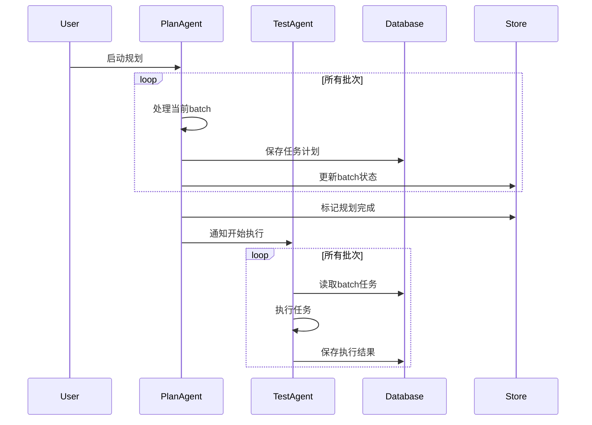
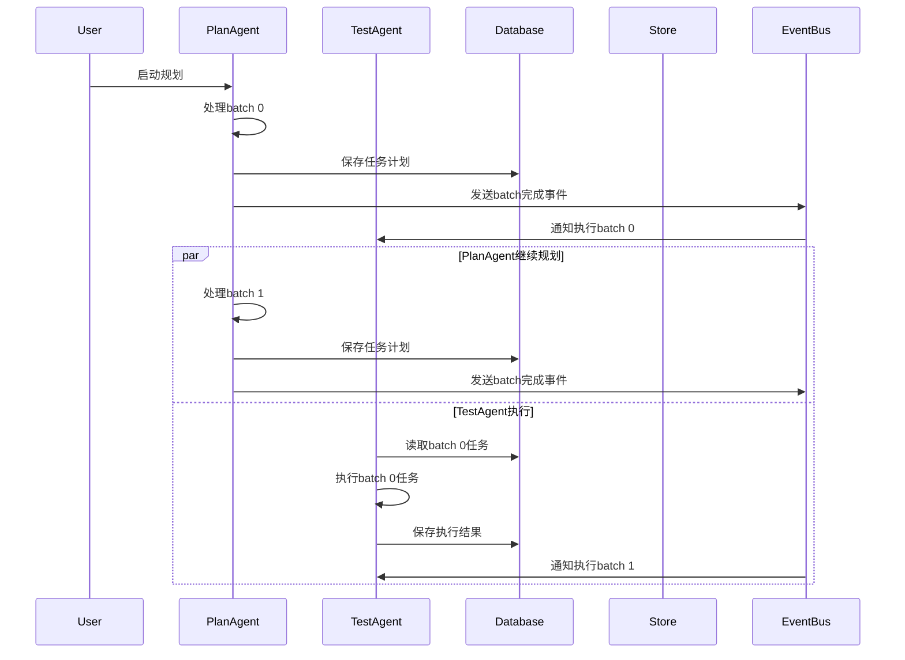

# PlanAgent与TestAgent协作模式技术实现文档

## 概述

本文档详细描述了PlanAgent和TestAgent两种协作模式的技术实现方案：
1. **串行模式**：PlanAgent完成所有batch后TestAgent统一执行
2. **并发模式**：PlanAgent和TestAgent交替执行，实现流水线处理

## 1. 串行模式实现方案

### 1.1 架构设计



### 1.2 核心实现

#### 1.2.1 PlanAgent修改

```typescript
// PlanAgent.ts - 添加完成状态管理
async planNode(state: typeof MessagesAnnotation.State, config: LangGraphRunnableConfig) {
    // ... 现有逻辑 ...
    
    // 检查是否所有批次都已完成规划
    if (nextBatchIndex >= totalBatches) {
        // 标记规划阶段完成
        const planCompletionState = {
            planningCompleted: true,
            totalBatches,
            completedAt: new Date().toISOString()
        };
        
        if (store && typeof store.put === "function") {
            await store.put(ns, "planCompletion", planCompletionState);
        }
        
        console.log(`[PlanAgent] All ${totalBatches} batches planned. Planning phase completed.`);
        return { messages: [new AIMessage({ content: `规划阶段完成，共生成${totalBatches}个批次的任务计划` })] };
    }
    
    // ... 继续现有批次处理逻辑 ...
}

// 添加路由判断逻辑
async takeActionOrGeneratePlan(
    _state: typeof MessagesAnnotation.State,
    config: LangGraphRunnableConfig,
): Promise<"plan-node" | "notify-test-agent" | typeof END> {
    const threadId = (config?.configurable as any)?.thread_id ?? this.lastThreadId ?? "default";
    const store: any = (config as any)?.store ?? (this.memoryManager?.getStore?.() as any);
    const ns = ["plans", this.config.namespace.project, this.config.namespace.environment, this.config.namespace.agent_type, threadId];
    
    // 检查规划完成状态
    const planCompletionRaw = store ? await store.get(ns, "planCompletion") : null;
    const planCompletion = (planCompletionRaw && typeof planCompletionRaw === "object" && "value" in planCompletionRaw)
        ? planCompletionRaw.value
        : planCompletionRaw;
    
    if (planCompletion?.planningCompleted) {
        return "notify-test-agent";
    }
    
    // 检查批次状态
    const batchStateRaw = store ? await store.get(ns, "toolBatch") : null;
    const batchState = (batchStateRaw && typeof batchStateRaw === "object" && "value" in batchStateRaw)
        ? batchStateRaw.value
        : batchStateRaw;
    
    if (batchState && batchState.batchIndex >= batchState.totalBatches) {
        return "notify-test-agent";
    }
    
    return "plan-node";
}

// 添加通知节点
async notifyTestAgent(state: typeof MessagesAnnotation.State, config: LangGraphRunnableConfig) {
    const threadId = (config?.configurable as any)?.thread_id ?? "default";
    const store: any = (config as any)?.store ?? (this.memoryManager?.getStore?.() as any);
    const ns = ["plans", this.config.namespace.project, this.config.namespace.environment, this.config.namespace.agent_type, threadId];
    
    // 设置TestAgent启动信号
    const testAgentSignal = {
        shouldStart: true,
        planningCompleted: true,
        timestamp: new Date().toISOString()
    };
    
    if (store && typeof store.put === "function") {
        await store.put(ns, "testAgentSignal", testAgentSignal);
    }
    
    console.log(`[PlanAgent] Notified TestAgent to start execution for threadId=${threadId}`);
    return { messages: [new AIMessage({ content: "已通知TestAgent开始执行任务" })] };
}
```

#### 1.2.2 TestAgent修改

```typescript
// TestAgent.ts - 添加启动条件检查
async ExecuteTestNode(state: typeof MessagesAnnotation.State, config: LangGraphRunnableConfig) {
    const threadId = (config?.configurable as any)?.thread_id ?? "default";
    const runtimeStore: any = (config as any)?.store ?? (this.memoryManager?.getStore?.() as any);
    const usingRuntimeStore = !!(runtimeStore && typeof runtimeStore.get === "function");
    
    const nsPlans = [
        "plans",
        this.config.namespace.project,
        this.config.namespace.environment,
        this.config.namespace.agent_type,
        threadId,
    ];
    
    // 检查PlanAgent是否完成规划
    const testAgentSignalRaw = usingRuntimeStore
        ? await runtimeStore.get(nsPlans, "testAgentSignal")
        : null;
    const testAgentSignal = (testAgentSignalRaw && typeof testAgentSignalRaw === "object" && "value" in testAgentSignalRaw)
        ? testAgentSignalRaw.value
        : testAgentSignalRaw;
    
    if (!testAgentSignal?.shouldStart) {
        console.log(`[ExecuteTestNode] Waiting for PlanAgent to complete planning...`);
        return { messages: [new AIMessage({ content: "等待PlanAgent完成规划阶段..." })] };
    }
    
    // 获取所有批次信息
    const existingBatchStateRaw = usingRuntimeStore
        ? await runtimeStore.get(nsPlans, "toolBatch")
        : await this.getSharedMemory(`planNode:${threadId}:toolBatch`);
    const existingBatchState = (existingBatchStateRaw && typeof existingBatchStateRaw === "object" && "value" in existingBatchStateRaw)
        ? existingBatchStateRaw.value
        : existingBatchStateRaw;
    
    const totalBatches: number = existingBatchState?.totalBatches ?? 1;
    
    // 获取或初始化执行进度
    const nsExec = [...nsPlans];
    let execProgressRaw = usingRuntimeStore ? await runtimeStore.get(nsExec, "executeProgress") : undefined;
    let execProgress = (execProgressRaw && typeof execProgressRaw === "object" && "value" in execProgressRaw)
        ? execProgressRaw.value
        : execProgressRaw;
    
    if (!execProgress) {
        execProgress = { currentBatch: 0, totalBatches, taskIndex: 0 };
        if (usingRuntimeStore && typeof runtimeStore.put === "function") {
            await runtimeStore.put(nsExec, "executeProgress", execProgress);
        }
    }
    
    // 检查是否所有批次都已执行完成
    if (execProgress.currentBatch >= totalBatches) {
        console.log(`[ExecuteTestNode] All batches executed (${execProgress.currentBatch}/${totalBatches})`);
        return { messages: [new AIMessage({ content: `所有${totalBatches}个批次执行完成` })] };
    }
    
    // 执行当前批次
    const currentBatch = execProgress.currentBatch;
    const tasks = await this.memoryManager.getTaskPlansByBatch(threadId, currentBatch);
    
    if (!tasks || tasks.length === 0) {
        // 当前批次无任务，跳到下一批次
        const newProgress = { ...execProgress, currentBatch: currentBatch + 1, taskIndex: 0 };
        if (usingRuntimeStore && typeof runtimeStore.put === "function") {
            await runtimeStore.put(nsExec, "executeProgress", newProgress);
        }
        return { messages: [new AIMessage({ content: `批次${currentBatch}无任务，跳转到下一批次` })] };
    }
    
    // ... 继续现有任务执行逻辑 ...
    // 当批次完成时，更新进度到下一批次
    if (execProgress.taskIndex >= tasks.length) {
        const newProgress = { ...execProgress, currentBatch: currentBatch + 1, taskIndex: 0 };
        if (usingRuntimeStore && typeof runtimeStore.put === "function") {
            await runtimeStore.put(nsExec, "executeProgress", newProgress);
        }
        console.log(`[ExecuteTestNode] Batch ${currentBatch} completed, moving to batch ${currentBatch + 1}`);
    }
    
    // ... 现有任务执行逻辑 ...
}
```

### 1.3 优缺点分析

#### 优点
- **简单可靠**：逻辑清晰，状态管理简单
- **资源利用**：避免并发冲突，资源使用更可控
- **调试友好**：问题定位容易，日志清晰
- **数据一致性**：避免并发写入导致的数据不一致

#### 缺点
- **执行效率低**：总执行时间较长
- **资源浪费**：TestAgent在等待期间空闲
- **响应延迟**：用户需要等待所有规划完成才能看到执行结果

## 2. 并发模式实现方案

### 2.1 架构设计



### 2.2 核心实现

#### 2.2.1 事件总线实现

```typescript
// EventBus.ts - 新增事件总线
export interface BatchEvent {
    type: 'BATCH_PLANNED' | 'BATCH_EXECUTED' | 'PLANNING_COMPLETED' | 'EXECUTION_COMPLETED';
    threadId: string;
    batchIndex: number;
    totalBatches: number;
    timestamp: string;
    data?: any;
}

export class AgentEventBus {
    private store: any;
    private namespace: string[];
    
    constructor(store: any, namespace: string[]) {
        this.store = store;
        this.namespace = namespace;
    }
    
    async publishEvent(event: BatchEvent): Promise<void> {
        const eventKey = `events:${event.threadId}:${event.type}:${event.batchIndex}`;
        const eventData = {
            ...event,
            id: `${event.threadId}-${event.type}-${event.batchIndex}-${Date.now()}`,
            processed: false
        };
        
        if (this.store && typeof this.store.put === "function") {
            await this.store.put([...this.namespace, "events"], eventKey, eventData);
        }
        
        console.log(`[EventBus] Published event: ${event.type} for batch ${event.batchIndex}`);
    }
    
    async getUnprocessedEvents(threadId: string, eventType: string): Promise<BatchEvent[]> {
        if (!this.store || typeof this.store.list !== "function") {
            return [];
        }
        
        try {
            const events = await this.store.list([...this.namespace, "events"]);
            return events
                .filter((item: any) => {
                    const event = item.value || item;
                    return event.threadId === threadId && 
                           event.type === eventType && 
                           !event.processed;
                })
                .map((item: any) => item.value || item)
                .sort((a: BatchEvent, b: BatchEvent) => a.batchIndex - b.batchIndex);
        } catch (error) {
            console.warn(`[EventBus] Failed to get events:`, error);
            return [];
        }
    }
    
    async markEventProcessed(threadId: string, eventType: string, batchIndex: number): Promise<void> {
        const eventKey = `events:${threadId}:${eventType}:${batchIndex}`;
        
        try {
            const existingEvent = await this.store.get([...this.namespace, "events"], eventKey);
            if (existingEvent) {
                const eventData = existingEvent.value || existingEvent;
                eventData.processed = true;
                eventData.processedAt = new Date().toISOString();
                
                await this.store.put([...this.namespace, "events"], eventKey, eventData);
                console.log(`[EventBus] Marked event processed: ${eventType} for batch ${batchIndex}`);
            }
        } catch (error) {
            console.warn(`[EventBus] Failed to mark event processed:`, error);
        }
    }
}
```

#### 2.2.2 PlanAgent并发模式修改

```typescript
// PlanAgent.ts - 并发模式实现
import { AgentEventBus, BatchEvent } from './EventBus.js';

export class PlanAgent extends BaseAgent {
    private eventBus: AgentEventBus;
    
    constructor(config: AgentConfig) {
        super(config);
    }
    
    private initEventBus(store: any, threadId: string) {
        if (!this.eventBus) {
            const ns = [
                "events",
                this.config.namespace.project,
                this.config.namespace.environment,
                this.config.namespace.agent_type,
                threadId,
            ];
            this.eventBus = new AgentEventBus(store, ns);
        }
    }
    
    async planNode(state: typeof MessagesAnnotation.State, config: LangGraphRunnableConfig) {
        const threadId = (config?.configurable as any)?.thread_id ?? "default";
        const store: any = (config as any)?.store ?? (this.memoryManager?.getStore?.() as any);
        
        this.initEventBus(store, threadId);
        
        // ... 现有批次处理逻辑 ...
        
        // 在保存任务计划后，发布批次完成事件
        if (tasksArray.length > 0) {
            try {
                await this.memoryManager.saveTaskPlans(threadId, toSave);
                console.log("[PlanAgent] Task plans saved to DB successfully.");
                
                // 发布批次规划完成事件
                await this.eventBus.publishEvent({
                    type: 'BATCH_PLANNED',
                    threadId,
                    batchIndex,
                    totalBatches,
                    timestamp: new Date().toISOString(),
                    data: { taskCount: tasksArray.length }
                });
                
            } catch (e) {
                console.error("[PlanAgent] saveTaskPlans error:", e);
            }
        }
        
        // 推进到下一批次
        if (startIndex < totalTools) {
            const nextBatchIndex = Math.min(batchIndex + 1, totalBatches);
            // ... 现有状态更新逻辑 ...
            
            // 如果所有批次规划完成，发布规划完成事件
            if (nextBatchIndex >= totalBatches) {
                await this.eventBus.publishEvent({
                    type: 'PLANNING_COMPLETED',
                    threadId,
                    batchIndex: totalBatches,
                    totalBatches,
                    timestamp: new Date().toISOString()
                });
            }
        }
        
        return { messages: [new AIMessage({ content: `批次${batchIndex}规划完成，共生成${tasksArray.length}个任务` })] };
    }
}
```

#### 2.2.3 TestAgent并发模式修改

```typescript
// TestAgent.ts - 并发模式实现
import { AgentEventBus, BatchEvent } from './EventBus.js';

export class ExecuteTestAgent extends BaseAgent {
    private eventBus: AgentEventBus;
    
    private initEventBus(store: any, threadId: string) {
        if (!this.eventBus) {
            const ns = [
                "events",
                this.config.namespace.project,
                this.config.namespace.environment,
                this.config.namespace.agent_type,
                threadId,
            ];
            this.eventBus = new AgentEventBus(store, ns);
        }
    }
    
    async ExecuteTestNode(state: typeof MessagesAnnotation.State, config: LangGraphRunnableConfig) {
        const threadId = (config?.configurable as any)?.thread_id ?? "default";
        const runtimeStore: any = (config as any)?.store ?? (this.memoryManager?.getStore?.() as any);
        
        this.initEventBus(runtimeStore, threadId);
        
        // 检查是否有待处理的批次规划完成事件
        const batchPlannedEvents = await this.eventBus.getUnprocessedEvents(threadId, 'BATCH_PLANNED');
        
        if (batchPlannedEvents.length === 0) {
            // 检查规划是否完全完成
            const planningCompletedEvents = await this.eventBus.getUnprocessedEvents(threadId, 'PLANNING_COMPLETED');
            if (planningCompletedEvents.length === 0) {
                console.log(`[ExecuteTestNode] No batches ready for execution, waiting...`);
                return { messages: [new AIMessage({ content: "等待PlanAgent完成批次规划..." })] };
            }
        }
        
        // 获取下一个要执行的批次
        const nextBatchEvent = batchPlannedEvents[0];
        if (!nextBatchEvent) {
            console.log(`[ExecuteTestNode] No more batches to execute`);
            return { messages: [new AIMessage({ content: "所有批次执行完成" })] };
        }
        
        const batchIndex = nextBatchEvent.batchIndex;
        console.log(`[ExecuteTestNode] Starting execution of batch ${batchIndex}`);
        
        // 获取当前批次的任务
        const tasks = await this.memoryManager.getTaskPlansByBatch(threadId, batchIndex);
        
        if (!tasks || tasks.length === 0) {
            // 标记事件为已处理
            await this.eventBus.markEventProcessed(threadId, 'BATCH_PLANNED', batchIndex);
            console.log(`[ExecuteTestNode] Batch ${batchIndex} has no tasks, skipping`);
            return { messages: [new AIMessage({ content: `批次${batchIndex}无任务，已跳过` })] };
        }
        
        // 获取执行进度
        const nsExec = [
            "execution",
            this.config.namespace.project,
            this.config.namespace.environment,
            this.config.namespace.agent_type,
            threadId,
        ];
        
        let execProgressRaw = await runtimeStore.get(nsExec, `batch-${batchIndex}`);
        let execProgress = (execProgressRaw && typeof execProgressRaw === "object" && "value" in execProgressRaw)
            ? execProgressRaw.value
            : execProgressRaw;
        
        if (!execProgress) {
            execProgress = { batchIndex, taskIndex: 0, totalTasks: tasks.length };
            await runtimeStore.put(nsExec, `batch-${batchIndex}`, execProgress);
        }
        
        // 检查当前批次是否已完成
        if (execProgress.taskIndex >= tasks.length) {
            // 标记批次执行完成
            await this.eventBus.publishEvent({
                type: 'BATCH_EXECUTED',
                threadId,
                batchIndex,
                totalBatches: nextBatchEvent.totalBatches,
                timestamp: new Date().toISOString(),
                data: { executedTasks: tasks.length }
            });
            
            // 标记规划事件为已处理
            await this.eventBus.markEventProcessed(threadId, 'BATCH_PLANNED', batchIndex);
            
            console.log(`[ExecuteTestNode] Batch ${batchIndex} execution completed`);
            return { messages: [new AIMessage({ content: `批次${batchIndex}执行完成，共执行${tasks.length}个任务` })] };
        }
        
        // 执行当前任务
        const task = tasks[execProgress.taskIndex];
        // ... 现有任务执行逻辑 ...
        
        // 更新执行进度
        const newProgress = { ...execProgress, taskIndex: execProgress.taskIndex + 1 };
        await runtimeStore.put(nsExec, `batch-${batchIndex}`, newProgress);
        
        // ... 继续现有任务执行逻辑 ...
    }
}
```

### 2.3 状态同步机制

#### 2.3.1 批次状态管理

```typescript
// BatchStateManager.ts - 批次状态管理器
export interface BatchState {
    batchIndex: number;
    status: 'planning' | 'planned' | 'executing' | 'executed' | 'failed';
    planningStarted?: string;
    planningCompleted?: string;
    executionStarted?: string;
    executionCompleted?: string;
    taskCount?: number;
    executedTasks?: number;
    failedTasks?: number;
}

export class BatchStateManager {
    private store: any;
    private namespace: string[];
    
    constructor(store: any, namespace: string[]) {
        this.store = store;
        this.namespace = namespace;
    }
    
    async updateBatchState(threadId: string, batchIndex: number, updates: Partial<BatchState>): Promise<void> {
        const key = `batch-state-${batchIndex}`;
        const ns = [...this.namespace, threadId];
        
        try {
            const existingRaw = await this.store.get(ns, key);
            const existing = (existingRaw && typeof existingRaw === "object" && "value" in existingRaw)
                ? existingRaw.value
                : existingRaw || {};
            
            const newState = { ...existing, ...updates, batchIndex };
            await this.store.put(ns, key, newState);
            
            console.log(`[BatchStateManager] Updated batch ${batchIndex} state:`, updates);
        } catch (error) {
            console.error(`[BatchStateManager] Failed to update batch state:`, error);
        }
    }
    
    async getBatchState(threadId: string, batchIndex: number): Promise<BatchState | null> {
        const key = `batch-state-${batchIndex}`;
        const ns = [...this.namespace, threadId];
        
        try {
            const stateRaw = await this.store.get(ns, key);
            return (stateRaw && typeof stateRaw === "object" && "value" in stateRaw)
                ? stateRaw.value
                : stateRaw;
        } catch (error) {
            console.error(`[BatchStateManager] Failed to get batch state:`, error);
            return null;
        }
    }
    
    async getAllBatchStates(threadId: string): Promise<BatchState[]> {
        const ns = [...this.namespace, threadId];
        
        try {
            const items = await this.store.list(ns);
            return items
                .filter((item: any) => {
                    const key = item.key || '';
                    return key.startsWith('batch-state-');
                })
                .map((item: any) => item.value || item)
                .sort((a: BatchState, b: BatchState) => a.batchIndex - b.batchIndex);
        } catch (error) {
            console.error(`[BatchStateManager] Failed to get all batch states:`, error);
            return [];
        }
    }
}
```

### 2.4 优缺点分析

#### 优点
- **高效执行**：并行处理，总执行时间短
- **实时反馈**：用户可以实时看到执行进度
- **资源利用**：两个Agent同时工作，资源利用率高
- **灵活性**：可以根据需要调整并发策略

#### 缺点
- **复杂性高**：状态管理复杂，调试困难
- **并发冲突**：可能出现资源竞争和状态不一致
- **错误处理**：异常情况下的恢复机制复杂
- **依赖管理**：需要处理Agent间的依赖关系

## 3. 实施建议

### 3.1 选择建议

- **小规模项目**：推荐使用串行模式，简单可靠
- **大规模项目**：推荐使用并发模式，提高效率
- **开发阶段**：先实现串行模式，后续优化为并发模式
- **生产环境**：根据性能要求和维护成本选择

### 3.2 实施步骤

#### 串行模式实施步骤
1. 修改PlanAgent添加完成状态管理
2. 修改TestAgent添加启动条件检查
3. 更新路由逻辑
4. 测试验证

#### 并发模式实施步骤
1. 实现事件总线系统
2. 实现批次状态管理器
3. 修改PlanAgent支持事件发布
4. 修改TestAgent支持事件订阅
5. 添加错误处理和恢复机制
6. 全面测试验证

### 3.3 监控和调试

```typescript
// 添加监控日志
const logger = {
    logBatchPlanned: (threadId: string, batchIndex: number, taskCount: number) => {
        console.log(`[MONITOR] Batch planned: ${threadId}-${batchIndex}, tasks: ${taskCount}`);
    },
    logBatchExecuted: (threadId: string, batchIndex: number, executedTasks: number) => {
        console.log(`[MONITOR] Batch executed: ${threadId}-${batchIndex}, executed: ${executedTasks}`);
    },
    logAgentState: (agentType: string, threadId: string, state: any) => {
        console.log(`[MONITOR] ${agentType} state: ${threadId}`, state);
    }
};
```

## 4. 总结

两种协作模式各有优劣，选择时需要考虑：
- **项目规模**：小项目选串行，大项目选并发
- **性能要求**：高性能要求选并发模式
- **维护成本**：低维护成本选串行模式
- **团队技能**：复杂系统需要有经验的团队

建议从串行模式开始实现，在需要时再升级到并发模式，这样可以在保证功能正确性的前提下逐步优化性能。