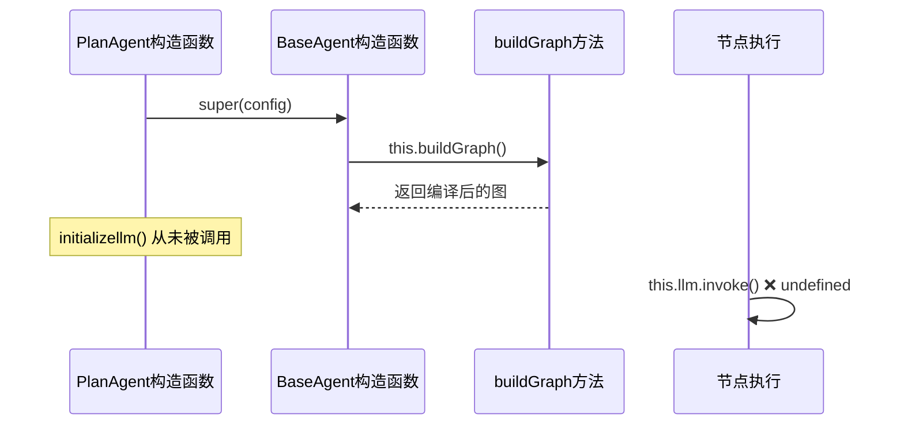

# PlanAgent 报错分析与解决方案

## 1. 问题概述

根据终端日志分析，PlanAgent 在执行过程中遇到了两个关键问题：

1. **SQL 工具返回空数据**：数据库查询返回空结果集
2. **LLM 调用失败**：`TypeError: Cannot read properties of undefined (reading 'invoke')`

## 2. 详细问题分析

### 2.1 SQL 工具返回空数据问题

**现象**：
```json
[PlanAgent] Query tables result: {
  "success": true,
  "data": {
    "rows": [],
    "count": 0
  }
}
```

**根本原因**：
- 目标数据库中没有任何用户表
- 查询 `information_schema.tables WHERE table_schema = 'public'` 返回空结果
- 这导致后续的示例数据查询也无法执行

**影响**：
- `queryResults` 状态中只包含空的表和列信息
- 无法为工具生成基于真实数据的测试计划
- LLM 生成的测试计划缺乏有效的参数数据

### 2.2 LLM 调用失败问题

**错误堆栈**：
```
[PlanAgent] PlanGenerationNode error: TypeError: Cannot read properties of undefined (reading 'invoke')
    at PlanAgent.planGenerationNode (E:\demo\agent\AutoMate\apps\agents\src\app\Agents\PlanAgent\PlanAgent.ts:178:39)
```

**根本原因**：
- `this.llm` 对象为 `undefined`
- `initializellm()` 方法从未被调用
- 在 `planGenerationNode` 中直接调用 `this.llm.invoke()` 导致错误

## 3. 架构问题深度分析

### 3.1 LLM 初始化时机问题

**当前架构流程**：


**问题分析**：
1. `BaseAgent` 构造函数立即调用 `buildGraph()`
2. 图构建完成后，节点方法已绑定但 LLM 未初始化
3. 当节点执行时，`this.llm` 仍为 `undefined`

### 3.2 与其他 Agent 的对比

**TestAgent 的正确实现**：
```typescript
async ExecuteTestNode(
  _state: typeof MessagesAnnotation.State,
  config: LangGraphRunnableConfig
) {
  // 确保LLM已初始化
  if (!this.llm) {
    console.log("[ExcuteTestNode] Initializing LLM...");
    await this.initializellm();
  }
  // ... 后续逻辑
}
```

**PlanAgent 的错误实现**：
```typescript
async planGenerationNode(
  state: typeof PlanAgentAnnotation.State,
  config: LangGraphRunnableConfig
): Promise<Partial<typeof PlanAgentAnnotation.State>> {
  // 直接调用 this.llm.invoke() 而未检查初始化状态
  const response = await this.llm.invoke([...]);
}
```

## 4. 解决方案

### 4.1 修复 LLM 初始化问题

**方案一：节点级别的懒加载初始化**

```typescript
async planGenerationNode(
  state: typeof PlanAgentAnnotation.State,
  config: LangGraphRunnableConfig
): Promise<Partial<typeof PlanAgentAnnotation.State>> {
  const threadId = (config?.configurable as any)?.thread_id ?? this.lastThreadId ?? "default";
  console.log(`[PlanAgent] PlanGenerationNode started for threadId: ${threadId}`);

  try {
    // 确保 LLM 已初始化
    if (!this.llm) {
      console.log('[PlanAgent] Initializing LLM...');
      await this.initializellm();
    }

    const { currentTool, queryResults, batchInfo, currentToolIndex } = state;
    
    if (!currentTool) {
      console.warn('[PlanAgent] No current tool specified');
      return { generatedPlans: [] };
    }

    if (!queryResults || Object.keys(queryResults).length === 0) {
      console.warn('[PlanAgent] No query results available');
      return { generatedPlans: [] };
    }

    console.log(`[PlanAgent] Generating plan for tool: ${currentTool.name}`);

    // 构建针对单个工具的提示词
    const toolPrompt = this.buildSingleToolPrompt(currentTool, queryResults, batchInfo, currentToolIndex);
    
    // 现在可以安全调用 LLM
    const response = await this.llm.invoke([
      { role: "system", content: toolPrompt },
      { role: "user", content: `Generate a test task for the tool "${currentTool.name}" using the provided real database data. Return a valid JSON object with the task details.` }
    ]);

    // ... 其余逻辑保持不变
  } catch (error) {
    console.error('[PlanAgent] PlanGenerationNode error:', error);
    return { generatedPlans: [] };
  }
}
```

**方案二：构造函数中预初始化**

```typescript
export class PlanAgent extends BaseAgent {
  private llm: any;
  private llmInitialized: boolean = false;
  private lastThreadId: string | null = null;

  constructor(config: AgentConfig) {
    super(config);
    // 异步初始化 LLM，但不阻塞构造函数
    this.initializeLLMAsync();
  }

  private async initializeLLMAsync() {
    try {
      await this.initializellm();
      this.llmInitialized = true;
      console.log('[PlanAgent] LLM initialized successfully');
    } catch (error) {
      console.error('[PlanAgent] Failed to initialize LLM:', error);
    }
  }

  protected async initializellm() {
    this.llm = await loadChatModel("openai/moonshotai/Kimi-K2-Instruct");
  }

  async planGenerationNode(
    state: typeof PlanAgentAnnotation.State,
    config: LangGraphRunnableConfig
  ): Promise<Partial<typeof PlanAgentAnnotation.State>> {
    // 等待 LLM 初始化完成
    if (!this.llmInitialized) {
      console.log('[PlanAgent] Waiting for LLM initialization...');
      await this.initializeLLMAsync();
    }
    
    // ... 其余逻辑
  }
}
```

### 4.2 处理空数据库问题

**增强数据查询节点的容错能力**：

```typescript
async dataQueryNode(
  _state: typeof PlanAgentAnnotation.State,
  config: LangGraphRunnableConfig
): Promise<Partial<typeof PlanAgentAnnotation.State>> {
  const threadId = (config?.configurable as any)?.thread_id ?? this.lastThreadId ?? "default";
  console.log(`[PlanAgent] DataQueryNode started for threadId: ${threadId}`);

  try {
    // 获取数据库MCP工具
    const dbTools = await getPostgresqlHubTools();
    console.log(`[PlanAgent] Loaded ${dbTools?.length} database MCP tools:`, dbTools.map(t => t.name));

    if (!dbTools || dbTools.length === 0) {
      console.warn('[PlanAgent] No database tools available');
      return {
        queryResults: { 
          error: 'No database tools available',
          fallbackData: this.generateFallbackData()
        }
      };
    }

    // 执行数据库查询以获取真实数据
    const queryResults: Record<string, any> = {};
    
    // 查询数据库模式信息
    const schemaQueries = [
      "SELECT table_name FROM information_schema.tables WHERE table_schema = 'public' ORDER BY table_name;",
      "SELECT column_name, data_type, is_nullable FROM information_schema.columns WHERE table_schema = 'public' ORDER BY table_name, ordinal_position;"
    ];

    for (const query of schemaQueries) {
      try {
        const sqlTool = dbTools.find(tool => tool.name === 'execute_sql');
        if (sqlTool) {
          const result = await sqlTool.call({ sql: query });
          const queryKey = query.includes('table_name') ? 'tables' : 'columns';
          queryResults[queryKey] = result;
          console.log(`[PlanAgent] Query ${queryKey} result:`, result);
        }
      } catch (error) {
        console.error(`[PlanAgent] Database query error:`, error);
        queryResults.error = error instanceof Error ? error.message : String(error);
      }
    }

    // 检查是否获取到有效数据
    const hasValidData = queryResults.tables && 
                        queryResults.tables.data && 
                        queryResults.tables.data.rows && 
                        queryResults.tables.data.rows.length > 0;

    if (!hasValidData) {
      console.warn('[PlanAgent] No tables found in database, using fallback data');
      queryResults.fallbackData = this.generateFallbackData();
      queryResults.usingFallback = true;
    } else {
      // 获取示例数据（从主要表中）
      for (const tableRow of queryResults.tables.data.rows.slice(0, 3)) {
        const tableName = tableRow.table_name;
        if (tableName) {
          try {
            const sqlTool = dbTools.find(tool => tool.name === 'execute_sql');
            if (sqlTool) {
              const sampleQuery = `SELECT * FROM "${tableName}" LIMIT 5;`;
              const sampleResult = await sqlTool.call({ sql: sampleQuery });
              queryResults[`sample_${tableName}`] = sampleResult;
              console.log(`[PlanAgent] Sample data from ${tableName}:`, sampleResult);
            }
          } catch (error) {
            console.warn(`[PlanAgent] Failed to get sample data from ${tableName}:`, error instanceof Error ? error.message : String(error));
          }
        }
      }
    }

    console.log('[PlanAgent] DataQueryNode completed successfully');
    return {
      queryResults
    };
  } catch (error) {
    console.error('[PlanAgent] DataQueryNode error:', error);
    return {
      queryResults: { 
        error: error instanceof Error ? error.message : String(error),
        fallbackData: this.generateFallbackData()
      }
    };
  }
}

// 生成回退数据的辅助方法
private generateFallbackData(): Record<string, any> {
  return {
    tables: {
      success: true,
      data: {
        rows: [
          { table_name: 'users' },
          { table_name: 'orders' },
          { table_name: 'products' }
        ],
        count: 3
      }
    },
    columns: {
      success: true,
      data: {
        rows: [
          { column_name: 'id', data_type: 'integer', is_nullable: 'NO' },
          { column_name: 'name', data_type: 'varchar', is_nullable: 'YES' },
          { column_name: 'email', data_type: 'varchar', is_nullable: 'YES' }
        ],
        count: 3
      }
    },
    sample_users: {
      success: true,
      data: {
        rows: [
          { id: 1, name: 'John Doe', email: 'john@example.com' },
          { id: 2, name: 'Jane Smith', email: 'jane@example.com' }
        ],
        count: 2
      }
    }
  };
}
```

### 4.3 增强计划生成节点的容错能力

```typescript
async planGenerationNode(
  state: typeof PlanAgentAnnotation.State,
  config: LangGraphRunnableConfig
): Promise<Partial<typeof PlanAgentAnnotation.State>> {
  const threadId = (config?.configurable as any)?.thread_id ?? this.lastThreadId ?? "default";
  console.log(`[PlanAgent] PlanGenerationNode started for threadId: ${threadId}`);

  try {
    // 确保 LLM 已初始化
    if (!this.llm) {
      console.log('[PlanAgent] Initializing LLM...');
      await this.initializellm();
    }

    const { currentTool, queryResults, batchInfo, currentToolIndex } = state;
    
    if (!currentTool) {
      console.warn('[PlanAgent] No current tool specified');
      return { generatedPlans: [] };
    }

    // 处理空查询结果的情况
    let effectiveQueryResults = queryResults;
    if (!queryResults || Object.keys(queryResults).length === 0) {
      console.warn('[PlanAgent] No query results available, using fallback data');
      effectiveQueryResults = { fallbackData: this.generateFallbackData() };
    } else if (queryResults.usingFallback || queryResults.fallbackData) {
      console.log('[PlanAgent] Using fallback data for plan generation');
      effectiveQueryResults = queryResults.fallbackData || queryResults;
    }

    console.log(`[PlanAgent] Generating plan for tool: ${currentTool.name}`);

    // 构建针对单个工具的提示词
    const toolPrompt = this.buildSingleToolPrompt(currentTool, effectiveQueryResults, batchInfo, currentToolIndex);
    
    // 调用 LLM 生成单个工具的测试计划
    const response = await this.llm.invoke([
      { role: "system", content: toolPrompt },
      { role: "user", content: `Generate a test task for the tool "${currentTool.name}" using the provided database data. Return a valid JSON object with the task details.` }
    ]);

    console.log(`[PlanAgent] LLM response for ${currentTool.name}:`, response);

    // 解析LLM响应
    let parsedPlan = null;
    try {
      const content = response.content || response;
      let text = typeof content === 'string' ? content : JSON.stringify(content);
      
      // 去除markdown代码块
      text = text.replace(/```(?:json)?\s*([\s\S]*?)\s*```/gi, "$1").trim();
      
      // 尝试解析JSON
      parsedPlan = JSON.parse(text);
      
      // 确保包含必要字段
      if (parsedPlan && typeof parsedPlan === 'object') {
        parsedPlan.toolName = parsedPlan.toolName || currentTool.name;
        parsedPlan.batchIndex = batchInfo?.batchIndex ?? 0;
        parsedPlan.expectedResult = parsedPlan.expectedResult || 'success';
        parsedPlan.usingFallbackData = !!effectiveQueryResults.fallbackData;
        
        // 验证parameters字段
        if (!parsedPlan.parameters || typeof parsedPlan.parameters !== 'object') {
          parsedPlan.parameters = {};
        }
      }
    } catch (error) {
      console.error(`[PlanAgent] Failed to parse plan for ${currentTool.name}:`, error);
      // 创建一个基本的fallback计划
      parsedPlan = {
        toolName: currentTool.name,
        description: `Test task for ${currentTool.name}`,
        parameters: {},
        complexity: "medium",
        batchIndex: batchInfo?.batchIndex ?? 0,
        expectedResult: "success",
        isRequiredValidateByDatabase: false,
        usingFallbackData: true
      };
    }

    console.log(`[PlanAgent] Generated plan for ${currentTool.name}:`, parsedPlan);
    
    return {
      generatedPlans: parsedPlan ? [parsedPlan] : []
    };
  } catch (error) {
    console.error('[PlanAgent] PlanGenerationNode error:', error);
    return { generatedPlans: [] };
  }
}
```

## 5. 推荐的修复步骤

### 5.1 立即修复（高优先级）

1. **修复 LLM 初始化问题**
   ```bash
   # 在 planGenerationNode 方法开头添加 LLM 初始化检查
   ```

2. **添加数据库容错机制**
   ```bash
   # 在 dataQueryNode 中添加 fallback 数据生成
   ```

### 5.2 架构优化（中优先级）

1. **统一初始化模式**
   - 在所有需要 LLM 的节点中添加初始化检查
   - 考虑在 BaseAgent 中提供统一的 LLM 初始化机制

2. **增强错误处理**
   - 为每个节点添加详细的错误日志
   - 实现优雅的降级机制

### 5.3 长期改进（低优先级）

1. **数据库初始化脚本**
   - 创建测试数据库的初始化脚本
   - 确保开发环境有基础的测试数据

2. **监控和告警**
   - 添加 LLM 初始化状态监控
   - 实现数据库连接状态检查

## 6. 验证方案

### 6.1 单元测试

```typescript
describe('PlanAgent LLM Initialization', () => {
  it('should initialize LLM before first use', async () => {
    const agent = new PlanAgent(mockConfig);
    expect(agent.llm).toBeUndefined();
    
    await agent.planGenerationNode(mockState, mockConfig);
    expect(agent.llm).toBeDefined();
  });

  it('should handle empty database gracefully', async () => {
    const agent = new PlanAgent(mockConfig);
    const result = await agent.dataQueryNode({}, mockConfig);
    
    expect(result.queryResults.fallbackData).toBeDefined();
    expect(result.queryResults.usingFallback).toBe(true);
  });
});
```

### 6.2 集成测试

```typescript
describe('PlanAgent End-to-End', () => {
  it('should complete full workflow with empty database', async () => {
    const agent = new PlanAgent(mockConfig);
    const graph = agent.buildGraph();
    
    const result = await graph.invoke(
      { messages: [] },
      { configurable: { thread_id: 'test-thread' } }
    );
    
    expect(result.generatedPlans).toHaveLength(4); // 4个工具
    expect(result.generatedPlans[0].usingFallbackData).toBe(true);
  });
});
```

## 7. 总结

通过以上分析和解决方案，我们可以彻底解决 PlanAgent 的报错问题：

1. **LLM 初始化问题**：通过在节点执行前检查并初始化 LLM 来解决
2. **空数据库问题**：通过 fallback 数据机制确保始终有可用的测试数据
3. **架构健壮性**：通过增强错误处理和容错机制提高系统稳定性

这些修复不仅解决了当前的问题，还为未来的扩展和维护奠定了良好的基础。