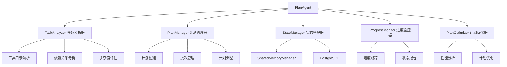

# PlanAgent改造技术文档

## 1. 现状分析

### 1.1 当前PlanAgent实现

基于对现有代码的分析，当前PlanAgent的实现相对简单：

```typescript
export class PlanAgent extends BaseAgent {
  private llm: any
  
  protected async initializellm() {
    this.llm = await loadChatModel("openai/deepseek-ai/DeepSeek-V3");
  }

  async planNode(state: typeof MessagesAnnotation.State, config: RunnableConfig) {
    // 获取工具列表
    const tools = await getTestServerTools();
    
    // 使用TOOL_MESSAGE_EXTRACT_PROMPT处理消息
    const llm = (await loadChatModel("openai/deepseek-ai/DeepSeek-V3")).bindTools(tools)
    
    // 调用LLM并返回结果
    const response = await llm.invoke([systemPrompt, ...state.messages]);
    return { messages: [response] };
  }
}
```

### 1.2 当前架构的局限性

1. **功能单一**：只是简单的工具调用代理，缺乏真正的计划制定能力
2. **无状态管理**：没有利用SharedMemoryManager进行计划状态持久化
3. **无迭代能力**：无法处理大量任务的分批执行和迭代计划
4. **缺乏计划逻辑**：没有任务分析、优先级排序、依赖关系处理等核心计划功能
5. **错误处理简单**：只有基础的try-catch，缺乏恢复机制
6. **无进度跟踪**：无法监控计划执行进度和状态

### 1.3 改造必要性

根据《PlanAgent迭代执行技术方案》，PlanAgent需要承担以下核心职责：

* 工具目录分析和任务分批

* 执行计划创建和管理

* 计划调整和优化

* 进度监控和状态管理

* 与ExecutionAgent和CoordinatorAgent协作

## 2. 改造目标

### 2.1 核心职责重新定义

**PlanAgent作为计划制定者和协调者**，应具备以下能力：

1. **智能任务分析**：分析工具目录，识别任务复杂度和依赖关系
2. **动态计划制定**：根据任务特性制定最优的分批执行计划
3. **状态持久化**：利用PostgreSQL记忆功能管理计划状态
4. **计划优化调整**：根据执行反馈动态调整后续计划
5. **进度监控**：实时跟踪计划执行进度和状态
6. **协作接口**：提供与其他Agent协作的标准接口

### 2.2 性能目标

* **可扩展性**：支持处理100+工具任务的大规模计划

* **容错性**：具备完善的错误处理和恢复机制

* **效率性**：优化任务分批算法，提高执行效率

* **可维护性**：清晰的模块化设计，便于扩展和维护

## 3. 架构设计

### 3.1 新架构概览



### 3.2 核心组件设计

#### 3.2.1 TaskAnalyzer - 任务分析器

负责分析工具目录，提取任务信息和依赖关系

```typescript
interface ToolTask {
  taskId: string;
  toolName: string;
  description: string;
  parameters: Record<string, any>;
  complexity: 'low' | 'medium' | 'high';
  estimatedDuration: number; // 秒
  dependencies: string[]; // 依赖的其他任务ID
  priority: number; // 1-10，数字越大优先级越高
  category: string; // 任务分类
}

interface TaskAnalysisResult {
  totalTasks: number;
  tasksByComplexity: Record<string, ToolTask[]>;
  dependencyGraph: Map<string, string[]>;
  estimatedTotalDuration: number;
  recommendedBatchSize: number;
}

class TaskAnalyzer {
  async analyzeToolCatalog(tools: any[]): Promise<TaskAnalysisResult>
  async extractTaskDependencies(tasks: ToolTask[]): Promise<Map<string, string[]>>
  async calculateComplexity(task: ToolTask): Promise<'low' | 'medium' | 'high'>
  async estimateDuration(task: ToolTask): Promise<number>
}
```

#### 3.2.2 PlanManager - 计划管理器

负责创建、管理和调整执行计划

```typescript
interface ExecutionPlan {
  planId: string;
  sessionId: string;
  totalTasks: number;
  plannedBatches: TaskBatch[];
  currentBatchIndex: number;
  status: 'planning' | 'executing' | 'completed' | 'failed' | 'paused';
  createdAt: Date;
  updatedAt: Date;
  metadata: {
    estimatedTotalDuration: number;
    actualDuration?: number;
    successRate?: number;
  };
}

interface TaskBatch {
  batchId: string;
  planId: string;
  tasks: ToolTask[];
  priority: number;
  estimatedDuration: number;
  dependencies?: string[]; // 依赖的其他批次ID
  status: 'planned' | 'assigned' | 'executing' | 'completed' | 'failed';
  assignedAt?: Date;
  startedAt?: Date;
  completedAt?: Date;
}

class PlanManager {
  async createExecutionPlan(analysisResult: TaskAnalysisResult): Promise<ExecutionPlan>
  async createTaskBatches(tasks: ToolTask[], batchSize: number): Promise<TaskBatch[]>
  async optimizeBatchOrder(batches: TaskBatch[]): Promise<TaskBatch[]>
  async adjustPlan(planId: string, executionResults: BatchResult[]): Promise<ExecutionPlan>
  async pausePlan(planId: string): Promise<void>
  async resumePlan(planId: string): Promise<void>
}
```

#### 3.2.3 StateManager - 状态管理器

负责计划状态的持久化和恢复

```typescript
class PlanStateManager {
  constructor(private memoryManager: SharedMemoryManager) {}
  
  async saveExecutionPlan(plan: ExecutionPlan): Promise<void> {
    const key = `plan_agent:plan:${plan.planId}`;
    await this.memoryManager.setSharedMemory(
      key,
      JSON.stringify(plan),
      'plan_agent',
      3600 * 24 // 24小时过期
    );
  }
  
  async loadExecutionPlan(planId: string): Promise<ExecutionPlan | null> {
    const key = `plan_agent:plan:${planId}`;
    const planJson = await this.memoryManager.getSharedMemory(
      key,
      'plan_agent'
    );
    return planJson ? JSON.parse(planJson) : null;
  }
  
  async updatePlanProgress(planId: string, progress: PlanProgress): Promise<void> {
    const key = `plan_agent:progress:${planId}`;
    await this.memoryManager.setSharedMemory(
      key,
      JSON.stringify(progress),
      'plan_agent',
      3600 * 12 // 12小时过期
    );
  }
  
  async saveBatchState(batch: TaskBatch): Promise<void> {
    const key = `plan_agent:batch:${batch.batchId}`;
    await this.memoryManager.setSharedMemory(
      key,
      JSON.stringify(batch),
      'plan_agent',
      3600 * 6 // 6小时过期
    );
  }
  
  async loadBatchState(batchId: string): Promise<TaskBatch | null> {
    const key = `plan_agent:batch:${batchId}`;
    const batchJson = await this.memoryManager.getSharedMemory(
      key,
      'plan_agent'
    );
    return batchJson ? JSON.parse(batchJson) : null;
  }
}
```

#### 3.2.4 ProgressMonitor - 进度监控器

负责跟踪计划执行进度

```typescript
interface PlanProgress {
  planId: string;
  totalBatches: number;
  completedBatches: number;
  failedBatches: number;
  currentBatchIndex: number;
  estimatedTimeRemaining: number;
  overallSuccessRate: number;
  lastUpdated: Date;
  currentStatus: string;
}

class ProgressMonitor {
  async calculateProgress(planId: string): Promise<PlanProgress>
  async updateBatchProgress(batchId: string, progress: number): Promise<void>
  async generateProgressReport(planId: string): Promise<string>
  async checkPlanHealth(planId: string): Promise<boolean>
}
```

#### 3.2.5 PlanOptimizer - 计划优化器

负责根据执行反馈优化计划

```typescript
interface OptimizationResult {
  adjustedBatches: TaskBatch[];
  rescheduledTasks: ToolTask[];
  optimizationReason: string;
  expectedImprovement: number; // 预期改进百分比
}

class PlanOptimizer {
  async analyzeExecutionResults(results: BatchResult[]): Promise<ExecutionAnalysis>
  async optimizeBatchSizes(plan: ExecutionPlan, performanceData: any): Promise<OptimizationResult>
  async rescheduleFailedTasks(plan: ExecutionPlan, failedTasks: ToolTask[]): Promise<OptimizationResult>
  async adjustPriorities(plan: ExecutionPlan, feedback: any): Promise<OptimizationResult>
}
```

## 4. 接口设计

### 4.1 主要接口定义

```typescript
// 改造后的PlanAgent主接口
export class PlanAgent extends BaseAgent {
  private taskAnalyzer: TaskAnalyzer;
  private planManager: PlanManager;
  private stateManager: PlanStateManager;
  private progressMonitor: ProgressMonitor;
  private planOptimizer: PlanOptimizer;
  private llm: any;
  
  constructor(config: AgentConfig) {
    super(config);
    this.taskAnalyzer = new TaskAnalyzer();
    this.planManager = new PlanManager();
    this.stateManager = new PlanStateManager(this.memoryManager);
    this.progressMonitor = new ProgressMonitor();
    this.planOptimizer = new PlanOptimizer();
  }
  
  // 核心计划制定方法
  async createExecutionPlan(tools: any[]): Promise<ExecutionPlan>
  
  // 计划调整方法
  async adjustPlan(planId: string, executionResults: BatchResult[]): Promise<ExecutionPlan>
  
  // 进度监控方法
  async monitorProgress(planId: string): Promise<PlanProgress>
  
  // 获取下一个待执行批次
  async getNextBatch(planId: string): Promise<TaskBatch | null>
  
  // 处理批次执行结果
  async processBatchResult(batchId: string, result: BatchResult): Promise<void>
  
  // 暂停/恢复计划
  async pausePlan(planId: string): Promise<void>
  async resumePlan(planId: string): Promise<void>
  
  // 计划状态查询
  async getPlanStatus(planId: string): Promise<ExecutionPlan | null>
  async listActivePlans(): Promise<ExecutionPlan[]>
}
```

### 4.2 消息接口设计

```typescript
// Agent间通信消息格式
interface PlanAgentMessage {
  type: 'create_plan' | 'adjust_plan' | 'get_next_batch' | 'report_result' | 'get_progress';
  payload: {
    planId?: string;
    sessionId?: string;
    tools?: any[];
    executionResults?: BatchResult[];
    batchResult?: BatchResult;
  };
  timestamp: Date;
  correlationId: string;
}

// 响应消息格式
interface PlanAgentResponse {
  success: boolean;
  data?: any;
  error?: string;
  timestamp: Date;
  correlationId: string;
}
```

## 5. 核心功能实现

### 5.1 工具目录分析和任务分批逻辑

```typescript
class TaskAnalyzer {
  async analyzeToolCatalog(tools: any[]): Promise<TaskAnalysisResult> {
    const tasks: ToolTask[] = [];
    
    // 1. 解析工具目录，提取任务信息
    for (const tool of tools) {
      const task: ToolTask = {
        taskId: `task_${Date.now()}_${Math.random().toString(36).substr(2, 9)}`,
        toolName: tool.name,
        description: tool.description || '',
        parameters: tool.parameters || {},
        complexity: await this.calculateComplexity(tool),
        estimatedDuration: await this.estimateDuration(tool),
        dependencies: await this.extractDependencies(tool, tools),
        priority: await this.calculatePriority(tool),
        category: this.categorizeTask(tool)
      };
      tasks.push(task);
    }
    
    // 2. 分析任务依赖关系
    const dependencyGraph = await this.buildDependencyGraph(tasks);
    
    // 3. 按复杂度分组
    const tasksByComplexity = this.groupTasksByComplexity(tasks);
    
    // 4. 计算总体指标
    const estimatedTotalDuration = tasks.reduce((sum, task) => sum + task.estimatedDuration, 0);
    const recommendedBatchSize = this.calculateOptimalBatchSize(tasks);
    
    return {
      totalTasks: tasks.length,
      tasksByComplexity,
      dependencyGraph,
      estimatedTotalDuration,
      recommendedBatchSize
    };
  }
  
  private async calculateComplexity(tool: any): Promise<'low' | 'medium' | 'high'> {
    // 基于工具参数数量、类型复杂度等因素计算
    const paramCount = Object.keys(tool.parameters || {}).length;
    const hasComplexTypes = this.hasComplexParameterTypes(tool.parameters);
    
    if (paramCount <= 2 && !hasComplexTypes) return 'low';
    if (paramCount <= 5 && !hasComplexTypes) return 'medium';
    return 'high';
  }
  
  private async estimateDuration(tool: any): Promise<number> {
    // 基于复杂度和历史数据估算执行时间
    const baseTime = 5; // 基础5秒
    const complexity = await this.calculateComplexity(tool);
    
    const multipliers = {
      'low': 1,
      'medium': 2,
      'high': 4
    };
    
    return baseTime * multipliers[complexity];
  }
  
  private calculateOptimalBatchSize(tasks: ToolTask[]): number {
    // 基于任务复杂度和总数量计算最优批次大小
    const avgComplexity = this.calculateAverageComplexity(tasks);
    const totalTasks = tasks.length;
    
    if (totalTasks <= 10) return Math.min(5, totalTasks);
    if (avgComplexity === 'high') return 3;
    if (avgComplexity === 'medium') return 5;
    return 7;
  }
}
```

### 5.2 执行计划创建和管理

```typescript
class PlanManager {
  async createExecutionPlan(analysisResult: TaskAnalysisResult): Promise<ExecutionPlan> {
    const planId = `plan_${Date.now()}_${Math.random().toString(36).substr(2, 9)}`;
    const sessionId = `session_${Date.now()}`;
    
    // 1. 创建任务批次
    const allTasks = Object.values(analysisResult.tasksByComplexity).flat();
    const batches = await this.createTaskBatches(allTasks, analysisResult.recommendedBatchSize);
    
    // 2. 优化批次顺序
    const optimizedBatches = await this.optimizeBatchOrder(batches);
    
    // 3. 创建执行计划
    const plan: ExecutionPlan = {
      planId,
      sessionId,
      totalTasks: analysisResult.totalTasks,
      plannedBatches: optimizedBatches,
      currentBatchIndex: 0,
      status: 'planning',
      createdAt: new Date(),
      updatedAt: new Date(),
      metadata: {
        estimatedTotalDuration: analysisResult.estimatedTotalDuration
      }
    };
    
    return plan;
  }
  
  async createTaskBatches(tasks: ToolTask[], batchSize: number): Promise<TaskBatch[]> {
    const batches: TaskBatch[] = [];
    
    // 1. 按优先级排序任务
    const sortedTasks = tasks.sort((a, b) => b.priority - a.priority);
    
    // 2. 分批创建
    for (let i = 0; i < sortedTasks.length; i += batchSize) {
      const batchTasks = sortedTasks.slice(i, i + batchSize);
      const batchId = `batch_${Date.now()}_${Math.random().toString(36).substr(2, 9)}`;
      
      const batch: TaskBatch = {
        batchId,
        planId: '', // 将在创建计划时设置
        tasks: batchTasks,
        priority: Math.max(...batchTasks.map(t => t.priority)),
        estimatedDuration: batchTasks.reduce((sum, t) => sum + t.estimatedDuration, 0),
        status: 'planned'
      };
      
      batches.push(batch);
    }
    
    return batches;
  }
  
  async optimizeBatchOrder(batches: TaskBatch[]): Promise<TaskBatch[]> {
    // 1. 按优先级排序
    const sortedBatches = batches.sort((a, b) => b.priority - a.priority);
    
    // 2. 处理依赖关系（简化版本）
    // 在实际实现中，这里需要更复杂的拓扑排序算法
    return sortedBatches;
  }
  
  async adjustPlan(planId: string, executionResults: BatchResult[]): Promise<ExecutionPlan> {
    // 1. 加载当前计划
    const currentPlan = await this.stateManager.loadExecutionPlan(planId);
    if (!currentPlan) {
      throw new Error(`Plan ${planId} not found`);
    }
    
    // 2. 分析执行结果
    const analysis = await this.analyzeExecutionResults(executionResults);
    
    // 3. 根据分析结果调整计划
    if (analysis.hasFailures) {
      await this.rescheduleFailedTasks(currentPlan, analysis.failedTasks);
    }
    
    if (analysis.performanceBelowExpected) {
      await this.optimizeBatchSizes(currentPlan, analysis.performanceMetrics);
    }
    
    // 4. 更新计划状态
    currentPlan.updatedAt = new Date();
    await this.stateManager.saveExecutionPlan(currentPlan);
    
    return currentPlan;
  }
}
```

### 5.3 计划调整和优化算法

```typescript
class PlanOptimizer {
  async analyzeExecutionResults(results: BatchResult[]): Promise<ExecutionAnalysis> {
    const analysis: ExecutionAnalysis = {
      totalBatches: results.length,
      successfulBatches: 0,
      failedBatches: 0,
      partialBatches: 0,
      averageExecutionTime: 0,
      failedTasks: [],
      performanceMetrics: {},
      hasFailures: false,
      performanceBelowExpected: false
    };
    
    let totalExecutionTime = 0;
    
    for (const result of results) {
      totalExecutionTime += result.executionTime;
      
      switch (result.status) {
        case 'completed':
          analysis.successfulBatches++;
          break;
        case 'failed':
          analysis.failedBatches++;
          analysis.hasFailures = true;
          break;
        case 'partial':
          analysis.partialBatches++;
          analysis.hasFailures = true;
          break;
      }
      
      // 收集失败的任务
      if (result.errors && result.errors.length > 0) {
        analysis.failedTasks.push(...result.errors.map(e => e.taskId));
      }
    }
    
    analysis.averageExecutionTime = totalExecutionTime / results.length;
    
    // 判断性能是否低于预期
    analysis.performanceBelowExpected = analysis.averageExecutionTime > this.getExpectedExecutionTime();
    
    return analysis;
  }
  
  async optimizeBatchSizes(plan: ExecutionPlan, performanceData: any): Promise<OptimizationResult> {
    const adjustedBatches: TaskBatch[] = [];
    
    for (const batch of plan.plannedBatches) {
      if (batch.status === 'planned') {
        // 根据性能数据调整批次大小
        if (performanceData.averageExecutionTime > batch.estimatedDuration * 1.5) {
          // 执行时间超出预期，减小批次大小
          const smallerBatches = await this.splitBatch(batch, 0.7);
          adjustedBatches.push(...smallerBatches);
        } else {
          adjustedBatches.push(batch);
        }
      } else {
        adjustedBatches.push(batch);
      }
    }
    
    return {
      adjustedBatches,
      rescheduledTasks: [],
      optimizationReason: 'Performance optimization based on execution data',
      expectedImprovement: 15
    };
  }
  
  async rescheduleFailedTasks(plan: ExecutionPlan, failedTaskIds: string[]): Promise<OptimizationResult> {
    const rescheduledTasks: ToolTask[] = [];
    const adjustedBatches: TaskBatch[] = [];
    
    // 1. 从失败的批次中提取失败的任务
    for (const batch of plan.plannedBatches) {
      const remainingTasks = batch.tasks.filter(task => !failedTaskIds.includes(task.taskId));
      const failedTasks = batch.tasks.filter(task => failedTaskIds.includes(task.taskId));
      
      if (remainingTasks.length > 0) {
        adjustedBatches.push({
          ...batch,
          tasks: remainingTasks
        });
      }
      
      rescheduledTasks.push(...failedTasks);
    }
    
    // 2. 创建新的批次来处理失败的任务
    if (rescheduledTasks.length > 0) {
      const retryBatch: TaskBatch = {
        batchId: `retry_batch_${Date.now()}`,
        planId: plan.planId,
        tasks: rescheduledTasks,
        priority: Math.max(...rescheduledTasks.map(t => t.priority)) + 1, // 提高优先级
        estimatedDuration: rescheduledTasks.reduce((sum, t) => sum + t.estimatedDuration, 0),
        status: 'planned'
      };
      
      adjustedBatches.push(retryBatch);
    }
    
    return {
      adjustedBatches,
      rescheduledTasks,
      optimizationReason: `Rescheduled ${failedTaskIds.length} failed tasks`,
      expectedImprovement: 10
    };
  }
}
```

### 5.4 进度监控和状态管理

```typescript
class ProgressMonitor {
  async calculateProgress(planId: string): Promise<PlanProgress> {
    const plan = await this.stateManager.loadExecutionPlan(planId);
    if (!plan) {
      throw new Error(`Plan ${planId} not found`);
    }
    
    const completedBatches = plan.plannedBatches.filter(b => b.status === 'completed').length;
    const failedBatches = plan.plannedBatches.filter(b => b.status === 'failed').length;
    const totalBatches = plan.plannedBatches.length;
    
    // 计算剩余时间
    const remainingBatches = plan.plannedBatches.filter(b => 
      b.status === 'planned' || b.status === 'assigned'
    );
    const estimatedTimeRemaining = remainingBatches.reduce(
      (sum, batch) => sum + batch.estimatedDuration, 0
    );
    
    // 计算成功率
    const completedTasks = plan.plannedBatches
      .filter(b => b.status === 'completed')
      .reduce((sum, batch) => sum + batch.tasks.length, 0);
    const totalTasks = plan.totalTasks;
    const overallSuccessRate = totalTasks > 0 ? (completedTasks / totalTasks) * 100 : 0;
    
    return {
      planId,
      totalBatches,
      completedBatches,
      failedBatches,
      currentBatchIndex: plan.currentBatchIndex,
      estimatedTimeRemaining,
      overallSuccessRate,
      lastUpdated: new Date(),
      currentStatus: plan.status
    };
  }
  
  async updateBatchProgress(batchId: string, progress: number): Promise<void> {
    const batch = await this.stateManager.loadBatchState(batchId);
    if (batch) {
      // 更新批次进度（这里可以扩展为更详细的进度跟踪）
      await this.stateManager.saveBatchState({
        ...batch,
        // 可以添加进度字段
      });
    }
  }
  
  async generateProgressReport(planId: string): Promise<string> {
    const progress = await this.calculateProgress(planId);
    
    return `
执行计划进度报告 (${planId}):
- 总批次数: ${progress.totalBatches}
- 已完成: ${progress.completedBatches}
- 失败: ${progress.failedBatches}
- 当前批次: ${progress.currentBatchIndex + 1}
- 整体成功率: ${progress.overallSuccessRate.toFixed(2)}%
- 预计剩余时间: ${Math.round(progress.estimatedTimeRemaining / 60)} 分钟
- 当前状态: ${progress.currentStatus}
- 最后更新: ${progress.lastUpdated.toISOString()}
    `;
  }
}
```

## 6. 状态管理

### 6.1 SharedMemoryManager集成

```typescript
// 扩展现有的SharedMemoryManager使用
class PlanStateManager {
  private readonly MEMORY_KEYS = {
    EXECUTION_PLAN: (planId: string) => `plan_agent:plan:${planId}`,
    PLAN_PROGRESS: (planId: string) => `plan_agent:progress:${planId}`,
    BATCH_STATE: (batchId: string) => `plan_agent:batch:${batchId}`,
    ACTIVE_PLANS: 'plan_agent:active_plans',
    PLAN_HISTORY: (planId: string) => `plan_agent:history:${planId}`
  };
  
  constructor(private memoryManager: SharedMemoryManager) {}
  
  async saveExecutionPlan(plan: ExecutionPlan): Promise<void> {
    const key = this.MEMORY_KEYS.EXECUTION_PLAN(plan.planId);
    await this.memoryManager.setSharedMemory(
      key,
      JSON.stringify(plan),
      'plan_agent',
      3600 * 24 // 24小时过期
    );
    
    // 同时更新活跃计划列表
    await this.updateActivePlansList(plan.planId, plan.status);
  }
  
  async loadExecutionPlan(planId: string): Promise<ExecutionPlan | null> {
    const key = this.MEMORY_KEYS.EXECUTION_PLAN(planId);
    const planJson = await this.memoryManager.getSharedMemory(
      key,
      'plan_agent'
    );
    return planJson ? JSON.parse(planJson) : null;
  }
  
  async updateActivePlansList(planId: string, status: string): Promise<void> {
    const key = this.MEMORY_KEYS.ACTIVE_PLANS;
    const activePlansJson = await this.memoryManager.getSharedMemory(
      key,
      'plan_agent'
    );
    
    let activePlans: string[] = activePlansJson ? JSON.parse(activePlansJson) : [];
    
    if (status === 'completed' || status === 'failed') {
      // 从活跃列表中移除
      activePlans = activePlans.filter(id => id !== planId);
    } else if (!activePlans.includes(planId)) {
      // 添加到活跃列表
      activePlans.push(planId);
    }
    
    await this.memoryManager.setSharedMemory(
      key,
      JSON.stringify(activePlans),
      'plan_agent',
      3600 * 48 // 48小时过期
    );
  }
  
  async listActivePlans(): Promise<ExecutionPlan[]> {
    const key = this.MEMORY_KEYS.ACTIVE_PLANS;
    const activePlansJson = await this.memoryManager.getSharedMemory(
      key,
      'plan_agent'
    );
    
    if (!activePlansJson) return [];
    
    const planIds: string[] = JSON.parse(activePlansJson);
    const plans: ExecutionPlan[] = [];
    
    for (const planId of planIds) {
      const plan = await this.loadExecutionPlan(planId);
      if (plan) {
        plans.push(plan);
      }
    }
    
    return plans;
  }
}
```

### 6.2 数据持久化策略

```typescript
// 数据分层存储策略
interface StorageStrategy {
  // 短期存储（内存缓存）- 当前活跃数据
  shortTerm: {
    currentBatch: TaskBatch;
    recentProgress: PlanProgress;
    activeConnections: Map<string, any>;
  };
  
  // 中期存储（PostgreSQL）- 执行状态和历史
  mediumTerm: {
    executionPlans: ExecutionPlan[];
    batchResults: BatchResult[];
    progressHistory: PlanProgress[];
  };
  
  // 长期存储（可选）- 分析和审计数据
  longTerm: {
    performanceMetrics: any[];
    optimizationHistory: any[];
    auditLogs: any[];
  };
}
```

## 7. 与现有架构集成

### 7.1 BaseAgent集成

```typescript
// 改造后的PlanAgent继承BaseAgent
export class PlanAgent extends BaseAgent {
  private taskAnalyzer: TaskAnalyzer;
  private planManager: PlanManager;
  private stateManager: PlanStateManager;
  private progressMonitor: ProgressMonitor;
  private planOptimizer: PlanOptimizer;
  private llm: any;
  
  constructor(config: AgentConfig) {
    super(config);
    this.initializeComponents();
  }
  
  private initializeComponents(): void {
    this.taskAnalyzer = new TaskAnalyzer();
    this.planManager = new PlanManager();
    this.stateManager = new PlanStateManager(this.memoryManager);
    this.progressMonitor = new ProgressMonitor();
    this.planOptimizer = new PlanOptimizer();
  }
  
  protected async initializellm(): Promise<void> {
    this.llm = await loadChatModel("openai/deepseek-ai/DeepSeek-V3");
  }
  
  // 重写buildGraph方法，支持新的计划制定流程
  protected buildGraph(): any {
    console.log("[PlanAgent] Building enhanced graph...");
    
    const workflow = new StateGraph(MessagesAnnotation, ConfigurationSchema)
      .addNode("analyze-tools", this.analyzeToolsNode.bind(this))
      .addNode("create-plan", this.createPlanNode.bind(this))
      .addNode("monitor-progress", this.monitorProgressNode.bind(this))
      .addNode("adjust-plan", this.adjustPlanNode.bind(this))
      .addEdge(START, "analyze-tools")
      .addEdge("analyze-tools", "create-plan")
      .addEdge("create-plan", "monitor-progress")
      .addEdge("monitor-progress", "adjust-plan")
      .addEdge("adjust-plan", END);
    
    console.log("[PlanAgent] Enhanced graph built successfully");
    return workflow.compile();
  }
  
  // 新的节点方法
  async analyzeToolsNode(state: typeof MessagesAnnotation.State, config: RunnableConfig) {
    const tools = await getTestServerTools();
    const analysisResult = await this.taskAnalyzer.analyzeToolCatalog(tools);
    
    return {
      messages: [new AIMessage({
        content: `工具分析完成：共${analysisResult.totalTasks}个任务，建议批次大小：${analysisResult.recommendedBatchSize}`
      })]
    };
  }
  
  async createPlanNode(state: typeof MessagesAnnotation.State, config: RunnableConfig) {
    const tools = await getTestServerTools();
    const analysisResult = await this.taskAnalyzer.analyzeToolCatalog(tools);
    const plan = await this.planManager.createExecutionPlan(analysisResult);
    
    // 保存计划到状态管理器
    await this.stateManager.saveExecutionPlan(plan);
    
    return {
      messages: [new AIMessage({
        content: `执行计划已创建：计划ID ${plan.planId}，共${plan.plannedBatches.length}个批次`
      })]
    };
  }
  
  async monitorProgressNode(state: typeof MessagesAnnotation.State, config: RunnableConfig) {
    // 这里可以实现进度监控逻辑
    return {
      messages: [new AIMessage({
        content: "进度监控节点执行完成"
      })]
    };
  }
  
  async adjustPlanNode(state: typeof MessagesAnnotation.State, config: RunnableConfig) {
    // 这里可以实现计划调整逻辑
    return {
      messages: [new AIMessage({
        content: "计划调整节点执行完成"
      })]
    };
  }
}
```

### 7.2 AgentManager集成

```typescript
// 修改AgentManager以支持新的PlanAgent
export class MultiAgentCoordinator {
  private memoryManager: SharedMemoryManager;
  private namespace: MemoryNamespace;
  private agents: Map<string, any> = new Map();
  
  public initializeAgents(): any {
    // 初始化增强的PlanAgent
    const planAgent = new PlanAgent({
      agentId: 'enhanced-plan-agent-001',
      agentType: 'planAgent',
      namespace: { ...this.namespace, agent_type: 'planAgent' },
      memoryManager: this.memoryManager
    });
    
    const planAgentNode = planAgent.buildGraph();
    
    // 创建支持计划制定的多Agent图
    const multiAgentGraph = new StateGraph(MessagesAnnotation)
      .addNode("plan-agent", planAgentNode)
      .addEdge(START, "plan-agent")
      .addEdge("plan-agent", END);
    
    this.agents.set('plan', planAgentNode);
    
    return multiAgentGraph;
  }
  
  // 新增计划管理方法
  async createExecutionPlan(tools: any[]): Promise<string> {
    const planAgent = this.agents.get('plan') as PlanAgent;
    if (!planAgent) {
      throw new Error('PlanAgent not initialized');
    }
    
    const plan = await planAgent.createExecutionPlan(tools);
    return plan.planId;
  }
  
  async getNextBatch(planId: string): Promise<TaskBatch | null> {
    const planAgent = this.agents.get('plan') as PlanAgent;
    return await planAgent.getNextBatch(planId);
  }
  
  async reportBatchResult(batchId: string, result: BatchResult): Promise<void> {
    const planAgent = this.agents.get('plan') as PlanAgent;
    await planAgent.processBatchResult(batchId, result);
  }
}
```

## 8. 实现步骤

### 8.1 第一阶段：基础架构搭建（1-2周）

**目标**：建立新的PlanAgent基础架构

**任务清单**：

1. **创建核心组件类**

   * [ ] 实现TaskAnalyzer基础框架

   * [ ] 实现PlanManager基础框架

   * [ ] 实现PlanStateManager基础框架

   * [ ] 实现ProgressMonitor基础框架

   * [ ] 实现PlanOptimizer基础框架

2. **定义数据结构**

   * [ ] 定义ToolTask接口

   * [ ] 定义ExecutionPlan接口

   * [ ] 定义TaskBatch接口

   * [ ] 定义PlanProgress接口

   * [ ] 定义BatchResult接口

3. **集成BaseAgent**

   * [ ] 修改PlanAgent继承结构

   * [ ] 实现新的buildGraph方法

   * [ ] 保持与现有接口的兼容性

**验收标准**：

* 所有核心组件类能够正常实例化

* 数据结构定义完整且类型安全

* PlanAgent能够正常继承BaseAgent并编译通过

### 8.2 第二阶段：核心功能实现（2-3周）

**目标**：实现计划制定和任务分析的核心功能

**任务清单**：

1. **任务分析功能**

   * [ ] 实现工具目录解析逻辑

   * [ ] 实现任务复杂度计算算法

   * [ ] 实现任务依赖关系分析

   * [ ] 实现最优批次大小计算

2. **计划管理功能**

   * [ ] 实现执行计划创建逻辑

   * [ ] 实现任务分批算法

   * [ ] 实现批次优先级排序

   * [ ] 实现计划调整机制

3. **状态管理功能**

   * [ ] 实现计划状态持久化

   * [ ] 实现批次状态管理

   * [ ] 实现活跃计划列表维护

   * [ ] 实现状态恢复机制

**验收标准**：

* 能够正确分析工具目录并生成任务列表

* 能够创建合理的执行计划和任务批次

* 状态能够正确保存到PostgreSQL并恢复

### 8.3 第三阶段：优化和监控（1-2周）

**目标**：实现计划优化和进度监控功能

**任务清单**：

1. **进度监控功能**

   * [ ] 实现进度计算逻辑

   * [ ] 实现进度报告生成

   * [ ] 实现实时状态更新

   * [ ] 实现健康检查机制

2. **计划优化功能**

   * [ ] 实现执行结果分析

   * [ ] 实现批次大小优化

   * [ ] 实现失败任务重调度

   * [ ] 实现性能优化建议

3. **错误处理和恢复**

   * [ ] 实现错误分类和处理

   * [ ] 实现重试机制

   * [ ] 实现故障恢复逻辑

   * [ ] 实现异常状态清理

**验收标准**：

* 能够准确计算和报告执行进度

* 能够根据执行反馈优化后续计划

* 具备完善的错误处理和恢复能力

### 8.4 第四阶段：集成和测试（1-2周）

**目标**：完成系统集成和全面测试

**任务清单**：

1. **系统集成**

   * [ ] 集成到现有AgentManager

   * [ ] 更新相关配置和依赖

   * [ ] 确保向后兼容性

   * [ ] 完善文档和注释

2. **测试覆盖**

   * [ ] 编写单元测试

   * [ ] 编写集成测试

   * [ ] 编写端到端测试

   * [ ] 进行性能测试

3. **优化调整**

   * [ ] 性能优化

   * [ ] 内存使用优化

   * [ ] 错误处理完善

   * [ ] 日志和监控完善

**验收标准**：

* 所有测试用例通过

* 性能指标满足要求

* 系统稳定性良好

* 文档完整准确

## 9. 代码示例

### 9.1 完整的PlanAgent实现示例

```typescript
// 完整的改造后PlanAgent实现
import { END, MessagesAnnotation, START, StateGraph } from "@langchain/langgraph";
import { BaseAgent, AgentConfig } from "../../BaseAgent/BaseAgent.js";
import { AIMessage, HumanMessage, SystemMessage } from "@langchain/core/messages";
import { ConfigurationSchema } from "../../ModelUtils/Config.js";
import { RunnableConfig } from "@langchain/core/runnables";
import { loadChatModel } from "../../ModelUtils/index.js";
import { getTestServerTools } from "src/app/mcp-servers/mcp-client.js";

// 导入新的组件
import { TaskAnalyzer, TaskAnalysisResult } from "./components/TaskAnalyzer.js";
import { PlanManager, ExecutionPlan, TaskBatch } from "./components/PlanManager.js";
import { PlanStateManager } from "./components/PlanStateManager.js";
import { ProgressMonitor, PlanProgress } from "./components/ProgressMonitor.js";
import { PlanOptimizer, BatchResult } from "./components/PlanOptimizer.js";

export class PlanAgent extends BaseAgent {
  private taskAnalyzer: TaskAnalyzer;
  private planManager: PlanManager;
  private stateManager: PlanStateManager;
  private progressMonitor: ProgressMonitor;
  private planOptimizer: PlanOptimizer;
  private llm: any;
  
  constructor(config: AgentConfig) {
    super(config);
    this.initializeComponents();
  }
  
  private initializeComponents(): void {
    this.taskAnalyzer = new TaskAnalyzer();
    this.planManager = new PlanManager();
    this.stateManager = new PlanStateManager(this.memoryManager);
    this.progressMonitor = new ProgressMonitor(this.stateManager);
    this.planOptimizer = new PlanOptimizer(this.stateManager);
  }
  
  protected async initializellm(): Promise<void> {
    this.llm = await loadChatModel("openai/deepseek-ai/DeepSeek-V3");
  }
  
  // 主要的计划制定方法
  async createExecutionPlan(tools: any[]): Promise<ExecutionPlan> {
    try {
      console.log("[PlanAgent] Starting execution plan creation...");
      
      // 1. 分析工具目录
      const analysisResult = await this.taskAnalyzer.analyzeToolCatalog(tools);
      console.log(`[PlanAgent] Tool analysis completed: ${analysisResult.totalTasks} tasks`);
      
      // 2. 创建执行计划
      const plan = await this.planManager.createExecutionPlan(analysisResult);
      console.log(`[PlanAgent] Execution plan created: ${plan.planId}`);
      
      // 3. 保存计划状态
      await this.stateManager.saveExecutionPlan(plan);
      console.log(`[PlanAgent] Plan saved to state manager`);
      
      return plan;
    } catch (error) {
      console.error("[PlanAgent] Error creating execution plan:", error);
      throw error;
    }
  }
  
  // 计划调整方法
  async adjustPlan(planId: string, executionResults: BatchResult[]): Promise<ExecutionPlan> {
    try {
      console.log(`[PlanAgent] Adjusting plan ${planId}...`);
      
      // 1. 加载当前计划
      const currentPlan = await this.stateManager.loadExecutionPlan(planId);
      if (!currentPlan) {
        throw new Error(`Plan ${planId} not found`);
      }
      
      // 2. 分析执行结果
      const analysis = await this.planOptimizer.analyzeExecutionResults(executionResults);
      console.log(`[PlanAgent] Execution analysis completed`);
      
      // 3. 优化计划
      let optimizationResult;
      if (analysis.hasFailures) {
        optimizationResult = await this.planOptimizer.rescheduleFailedTasks(
          currentPlan, 
          analysis.failedTasks
        );
      } else if (analysis.performanceBelowExpected) {
        optimizationResult = await this.planOptimizer.optimizeBatchSizes(
          currentPlan, 
          analysis.performanceMetrics
        );
      }
      
      // 4. 更新计划
      if (optimizationResult) {
        currentPlan.plannedBatches = optimizationResult.adjustedBatches;
        currentPlan.updatedAt = new Date();
        await this.stateManager.saveExecutionPlan(currentPlan);
        console.log(`[PlanAgent] Plan optimized: ${optimizationResult.optimizationReason}`);
      }
      
      return currentPlan;
    } catch (error) {
      console.error(`[PlanAgent] Error adjusting plan ${planId}:`, error);
      throw error;
    }
  }
  
  // 获取下一个待执行批次
  async getNextBatch(planId: string): Promise<TaskBatch | null> {
    try {
      const plan = await this.stateManager.loadExecutionPlan(planId);
      if (!plan) {
        console.warn(`[PlanAgent] Plan ${planId} not found`);
        return null;
      }
      
      // 查找下一个待执行的批次
      const nextBatch = plan.plannedBatches.find(batch => 
        batch.status === 'planned' || batch.status === 'assigned'
      );
      
      if (nextBatch) {
        // 标记为已分配
        nextBatch.status = 'assigned';
        nextBatch.assignedAt = new Date();
        
        // 更新计划状态
        await this.stateManager.saveExecutionPlan(plan);
        await this.stateManager.saveBatchState(nextBatch);
        
        console.log(`[PlanAgent] Next batch assigned: ${nextBatch.batchId}`);
      }
      
      return nextBatch || null;
    } catch (error) {
      console.error(`[PlanAgent] Error getting next batch for plan ${planId}:`, error);
      throw error;
    }
  }
  
  // 处理批次执行结果
  async processBatchResult(batchId: string, result: BatchResult): Promise<void> {
    try {
      console.log(`[PlanAgent] Processing batch result: ${batchId}`);
      
      // 1. 更新批次状态
      const batch = await this.stateManager.loadBatchState(batchId);
      if (batch) {
        batch.status = result.status;
        batch.completedAt = new Date();
        await this.stateManager.saveBatchState(batch);
      }
      
      // 2. 更新计划进度
      const plan = await this.stateManager.loadExecutionPlan(batch?.planId || '');
      if (plan) {
        const batchIndex = plan.plannedBatches.findIndex(b => b.batchId === batchId);
        if (batchIndex >= 0) {
          plan.plannedBatches[batchIndex] = { ...plan.plannedBatches[batchIndex], ...batch };
          plan.currentBatchIndex = Math.max(plan.currentBatchIndex, batchIndex + 1);
          
          // 检查是否所有批次都已完成
          const allCompleted = plan.plannedBatches.every(b => 
            b.status === 'completed' || b.status === 'failed'
          );
          
          if (allCompleted) {
            plan.status = 'completed';
            console.log(`[PlanAgent] Plan ${plan.planId} completed`);
          }
          
          await this.stateManager.saveExecutionPlan(plan);
        }
      }
      
      console.log(`[PlanAgent] Batch result processed successfully`);
    } catch (error) {
      console.error(`[PlanAgent] Error processing batch result ${batchId}:`, error);
      throw error;
    }
  }
  
  // 监控进度
  async monitorProgress(planId: string): Promise<PlanProgress> {
    try {
      const progress = await this.progressMonitor.calculateProgress(planId);
      
      // 更新进度到状态管理器
      await this.stateManager.updatePlanProgress(planId, progress);
      
      return progress;
    } catch (error) {
      console.error(`[PlanAgent] Error monitoring progress for plan ${planId}:`, error);
      throw error;
    }
  }
  
  // 暂停计划
  async pausePlan(planId: string): Promise<void> {
    const plan = await this.stateManager.loadExecutionPlan(planId);
    if (plan) {
      plan.status = 'paused';
      plan.updatedAt = new Date();
      await this.stateManager.saveExecutionPlan(plan);
      console.log(`[PlanAgent] Plan ${planId} paused`);
    }
  }
  
  // 恢复计划
  async resumePlan(planId: string): Promise<void> {
    const plan = await this.stateManager.loadExecutionPlan(planId);
    if (plan && plan.status === 'paused') {
      plan.status = 'executing';
      plan.updatedAt = new Date();
      await this.stateManager.saveExecutionPlan(plan);
      console.log(`[PlanAgent] Plan ${planId} resumed`);
    }
  }
  
  // 获取计划状态
  async getPlanStatus(planId: string): Promise<ExecutionPlan | null> {
    return await this.stateManager.loadExecutionPlan(planId);
  }
  
  // 列出活跃计划
  async listActivePlans(): Promise<ExecutionPlan[]> {
    return await this.stateManager.listActivePlans();
  }
  
  // 重写buildGraph方法
  protected buildGraph(): any {
    console.log("[PlanAgent] Building enhanced graph...");
    
    const workflow = new StateGraph(MessagesAnnotation, ConfigurationSchema)
      .addNode("plan-node", this.enhancedPlanNode.bind(this))
      .addEdge(START, "plan-node")
      .addEdge("plan-node", END);
    
    console.log("[PlanAgent] Enhanced graph built successfully");
    return workflow.compile();
  }
  
  // 增强的计划节点
  async enhancedPlanNode(state: typeof MessagesAnnotation.State, config: RunnableConfig) {
    try {
      const lastMessage = state.messages[state.messages.length - 1];
      console.log("[PlanAgent] Enhanced plan node processing:", lastMessage);
      
      // 确保LLM已初始化
      if (!this.llm) {
        await this.initializellm();
      }
      
      // 获取工具列表
      const tools = await getTestServerTools();
      
      // 创建执行计划
      const plan = await this.createExecutionPlan(tools);
      
      // 生成进度报告
      const progress = await this.monitorProgress(plan.planId);
      const progressReport = await this.progressMonitor.generateProgressReport(plan.planId);
      
      const response = new AIMessage({
        content: `执行计划已创建并开始监控：
计划ID: ${plan.planId}
总批次数: ${plan.plannedBatches.length}
预计总时长: ${Math.round(plan.metadata.estimatedTotalDuration / 60)} 分钟

${progressReport}`
      });
      
      return { messages: [response] };
    } catch (error) {
      console.error("[PlanAgent] Error in enhanced plan node:", error);
      const errorMessage = new AIMessage({
        content: `计划制定过程中发生错误: ${error.message}`
      });
      return { messages: [errorMessage] };
    }
  }
}
```

### 9.2 TaskAnalyzer实现示例

```typescript
// components/TaskAnalyzer.ts
export class TaskAnalyzer {
  async analyzeToolCatalog(tools: any[]): Promise<TaskAnalysisResult> {
    const tasks: ToolTask[] = [];
    
    for (const tool of tools) {
      const task: ToolTask = {
        taskId: `task_${Date.now()}_${Math.random().toString(36).substr(2, 9)}`,
        toolName: tool.name,
        description: tool.description || '',
        parameters: tool.parameters || {},
        complexity: await this.calculateComplexity(tool),
        estimatedDuration: await this.estimateDuration(tool),
        dependencies: [],
        priority: await this.calculatePriority(tool),
        category: this.categorizeTask(tool)
      };
      tasks.push(task);
    }
    
    const dependencyGraph = new Map<string, string[]>();
    const tasksByComplexity = this.groupTasksByComplexity(tasks);
    const estimatedTotalDuration = tasks.reduce((sum, task) => sum + task.estimatedDuration, 0);
    const recommendedBatchSize = this.calculateOptimalBatchSize(tasks);
    
    return {
      totalTasks: tasks.length,
      tasksByComplexity,
      dependencyGraph,
      estimatedTotalDuration,
      recommendedBatchSize
    };
  }
  
  private async calculateComplexity(tool: any): Promise<'low' | 'medium' | 'high'> {
    const paramCount = Object.keys(tool.parameters || {}).length;
    if (paramCount <= 2) return 'low';
    if (paramCount <= 5) return 'medium';
    return 'high';
  }
  
  private async estimateDuration(tool: any): Promise<number> {
    const complexity = await this.calculateComplexity(tool);
    const multipliers = { 'low': 5, 'medium': 10, 'high': 20 };
    return multipliers[complexity];
  }
  
  private async calculatePriority(tool: any): Promise<number> {
    // 基于工具类型和重要性计算优先级
    return Math.floor(Math.random() * 10) + 1;
  }
  
  private categorizeTask(tool: any): string {
    return tool.category || 'general';
  }
  
  private groupTasksByComplexity(tasks: ToolTask[]): Record<string, ToolTask[]> {
    return tasks.reduce((groups, task) => {
      if (!groups[task.complexity]) {
        groups[task.complexity] = [];
      }
      groups[task.complexity].push(task);
      return groups;
    }, {} as Record<string, ToolTask[]>);
  }
  
  private calculateOptimalBatchSize(tasks: ToolTask[]): number {
    const totalTasks = tasks.length;
    if (totalTasks <= 10) return Math.min(5, totalTasks);
    return 5;
  }
}
```

## 10. 测试方案

### 10.1 单元测试

```typescript
// tests/PlanAgent.test.ts
import { PlanAgent } from '../PlanAgent.js';
import { TaskAnalyzer } from '../components/TaskAnalyzer.js';

describe('PlanAgent', () => {
  let planAgent: PlanAgent;
  
  beforeEach(() => {
    const config = {
      agentId: 'test-plan-agent',
      agentType: 'planAgent',
      namespace: { agent_type: 'planAgent' },
      memoryManager: mockMemoryManager
    };
    planAgent = new PlanAgent(config);
  });
  
  describe('createExecutionPlan', () => {
    it('should create a valid execution plan', async () => {
      const mockTools = [
        { name: 'tool1', parameters: { param1: 'string' } },
        { name: 'tool2', parameters: { param1: 'string', param2: 'number' } }
      ];
      
      const plan = await planAgent.createExecutionPlan(mockTools);
      
      expect(plan).toBeDefined();
      expect(plan.planId).toBeTruthy();
      expect(plan.plannedBatches.length).toBeGreaterThan(0);
      expect(plan.status).toBe('planning');
    });
  });
  
  describe('getNextBatch', () => {
    it('should return the next available batch', async () => {
      // 测试获取下一个批次的逻辑
    });
  });
  
  describe('processBatchResult', () => {
    it('should update batch and plan status correctly', async () => {
      // 测试批次结果处理逻辑
    });
  });
});
```

### 10.2 集成测试

```typescript
// tests/integration/PlanAgent.integration.test.ts
describe('PlanAgent Integration', () => {
  it('should work with real SharedMemoryManager', async () => {
    // 测试与PostgreSQL的集成
  });
  
  it('should handle large tool catalogs', async () => {
    // 测试大规模工具目录处理
  });
  
  it('should recover from failures', async () => {
    // 测试故障恢复机制
  });
});
```

### 10.3 性能测试

```typescript
// tests/performance/PlanAgent.perf.test.ts
describe('PlanAgent Performance', () => {
  it('should handle 100+ tools efficiently', async () => {
    const startTime = Date.now();
    const largeCatalog = generateMockTools(100);
    
    const plan = await planAgent.createExecutionPlan(largeCatalog);
    
    const executionTime = Date.now() - startTime;
    expect(executionTime).toBeLessThan(5000); // 5秒内完成
  });
});
```

## 11. 总结

本技术文档详细描述了PlanAgent的改造方案，主要改进包括：

1. **架构升级**：从简单的工具调用代理升级为智能计划制定和协调系统
2. **功能增强**：新增任务分析、计划管理、状态持久化、进度监控和计划优化等核心功能
3. **可扩展性**：支持处理大规模工具目录和复杂执行计划
4. **容错性**：完善的错误处理和恢复机制
5. **集成性**：与现有BaseAgent和SharedMemoryManager无缝集成

通过这次改造，PlanAgent将能够有效解决LLM上下文长度限制问题，支持大规模API测试任务的迭代执行，为整个多Agent系统提供强大的计划制定和协调能力。
```

