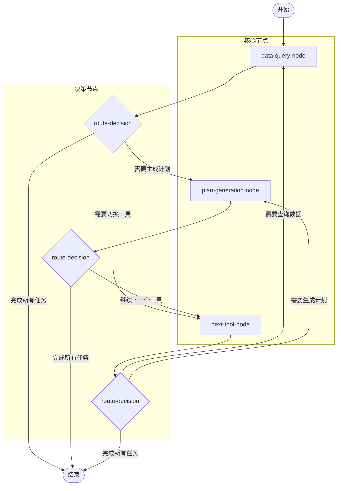
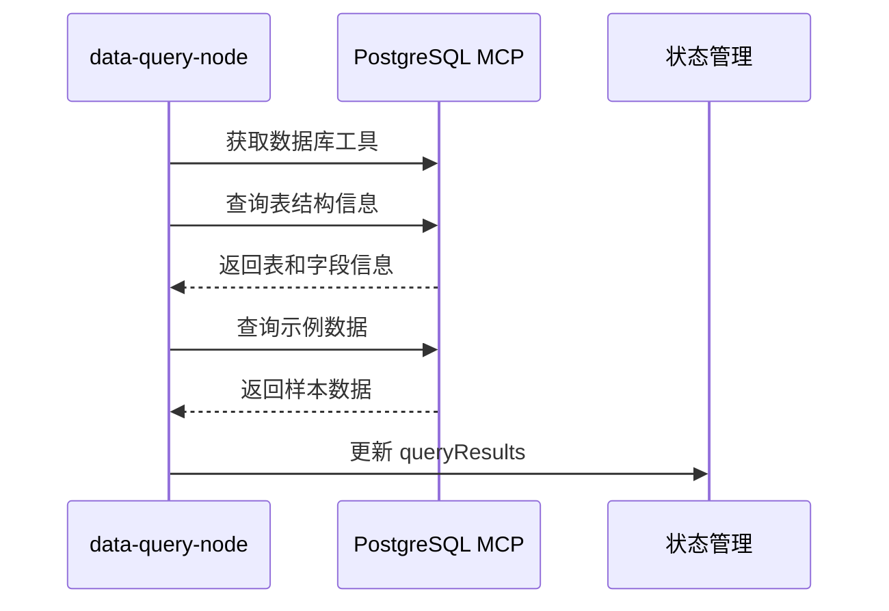
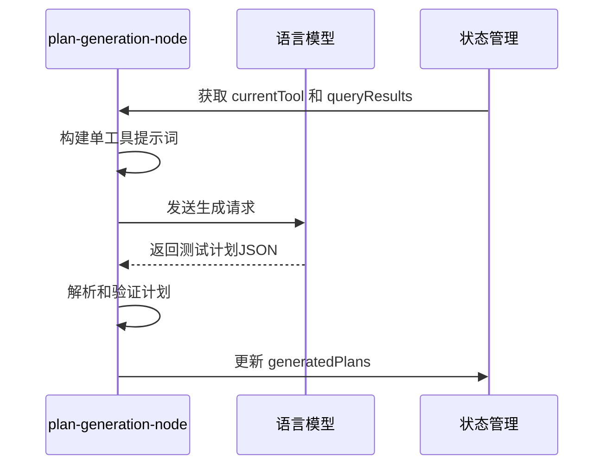
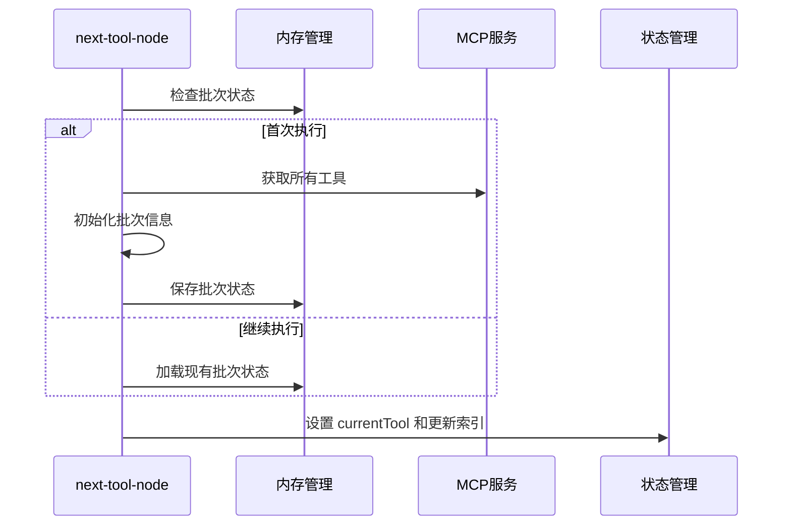
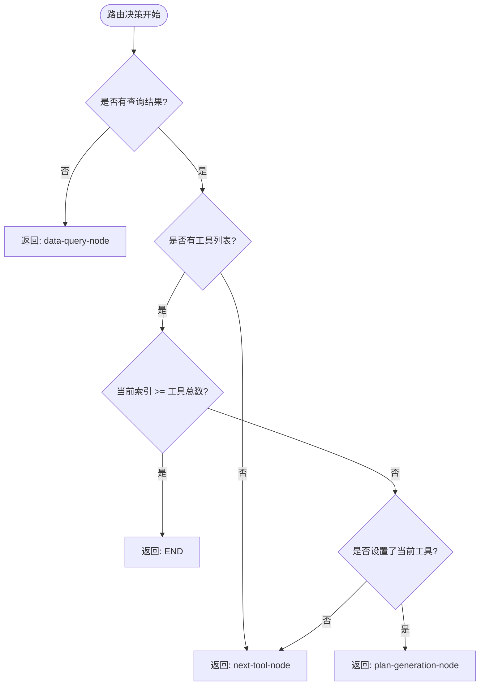

# PlanAgent 架构解析与数据流分析

## 1. 架构概述

### 1.1 整体架构设计

重构后的 PlanAgent 采用了基于 LangGraph 的多节点架构，将原有的单一 ReactAgent 节点拆分为多个专门化的节点，实现了职责分离和流程优化。



### 1.2 架构特点

- **职责分离**：每个节点专注于特定功能
- **确定性执行**：替换 ReactAgent 的不确定性工具调用
- **单工具处理**：每次只处理一个工具，降低复杂度
- **智能路由**：基于状态的动态路由决策
- **状态驱动**：通过状态管理实现节点间协调

## 2. 状态管理系统

### 2.1 PlanAgentAnnotation 状态定义

```typescript
const PlanAgentAnnotation = Annotation.Root({
  ...MessagesAnnotation.spec,
  // 当前工具索引，用于跟踪处理进度
  currentToolIndex: Annotation<number>({
    reducer: (x, y) => y ?? x ?? 0,
    default: () => 0,
  }),
  // 当前正在处理的工具信息
  currentTool: Annotation<any>({
    reducer: (x, y) => y ?? x ?? null,
    default: () => null,
  }),
  // 数据库查询结果，存储从data-query-node获取的数据
  queryResults: Annotation<Record<string, any>>({
    reducer: (x, y) => ({ ...x, ...y }),
    default: () => ({}),
  }),
  // 已生成的计划列表
  generatedPlans: Annotation<any[]>({
    reducer: (x, y) => [...(x ?? []), ...(y ?? [])],
    default: () => [],
  }),
  // 批次信息
  batchInfo: Annotation<{
    batchIndex: number;
    totalBatches: number;
    toolsPerBatch: number;
    totalTools: number;
  } | null>({
    reducer: (x, y) => y ?? x ?? null,
    default: () => null,
  }),
  // 工具列表
  toolsList: Annotation<any[]>({
    reducer: (x, y) => y ?? x ?? [],
    default: () => [],
  }),
})
```

### 2.2 状态字段说明

| 字段名 | 类型 | 作用 | 更新时机 |
|--------|------|------|----------|
| `currentToolIndex` | number | 跟踪当前处理的工具索引 | next-tool-node 中递增 |
| `currentTool` | any | 当前正在处理的工具对象 | next-tool-node 中设置 |
| `queryResults` | Record<string, any> | 数据库查询结果缓存 | data-query-node 中更新 |
| `generatedPlans` | any[] | 累积生成的测试计划 | plan-generation-node 中追加 |
| `batchInfo` | object | 批次处理信息 | next-tool-node 中初始化 |
| `toolsList` | any[] | 当前批次的工具列表 | next-tool-node 中设置 |

## 3. 核心节点详解

### 3.1 Data Query Node（数据查询节点）

**职责**：专门负责数据库查询，获取真实数据用于测试计划生成。

**核心功能**：
- 获取数据库 MCP 工具
- 执行数据库模式查询（表结构、字段信息）
- 获取示例数据（前3个表的样本数据）
- 将查询结果存储到 `queryResults` 状态中

**执行流程**：


**关键代码逻辑**：
```typescript
// 查询数据库模式信息
const schemaQueries = [
  "SELECT table_name FROM information_schema.tables WHERE table_schema = 'public' ORDER BY table_name;",
  "SELECT column_name, data_type, is_nullable FROM information_schema.columns WHERE table_schema = 'public' ORDER BY table_name, ordinal_position;"
];

// 获取示例数据
for (const tableRow of queryResults.tables.slice(0, 3)) {
  const sampleQuery = `SELECT * FROM "${tableName}" LIMIT 5;`;
  const sampleResult = await sqlTool.call({ sql: sampleQuery });
  queryResults[`sample_${tableName}`] = sampleResult;
}
```

### 3.2 Plan Generation Node（计划生成节点）

**职责**：基于查询到的真实数据，为单个工具生成测试计划。

**核心功能**：
- 构建针对单个工具的专门化提示词
- 调用 LLM 生成单个测试计划
- 解析和验证生成的计划
- 将计划添加到 `generatedPlans` 状态中

**执行流程**：


**提示词构建策略**：
```typescript
private buildSingleToolPrompt(tool: any, queryResults: Record<string, any>, batchInfo: any, toolIndex: number): string {
  return `You are a test task generator. Generate a single test task for the specified tool using real database data.

TOOL INFORMATION:
Name: ${tool.name}
Description: ${tool.description || 'No description available'}
Schema: ${JSON.stringify(toolSchema, null, 2)}

REAL DATABASE DATA:
${JSON.stringify(queryResults, null, 2)}

OUTPUT REQUIREMENTS:
1. Generate exactly ONE test task for the specified tool
2. Use ONLY real data from the database query results
3. Ensure parameters match the tool's schema
4. Return valid JSON with required fields
5. NO markdown formatting, NO extra text, ONLY valid JSON`;
}
```

### 3.3 Next Tool Node（工具切换节点）

**职责**：管理工具切换逻辑和批次初始化。

**核心功能**：
- 初始化批次信息和工具列表
- 设置当前要处理的工具
- 管理工具索引递增
- 处理批次状态持久化

**执行流程**：


**批次管理逻辑**：
```typescript
// 初始化新的批次状态
const toolsPerBatch = 5;
const allTools = await this.getAllTools();
const totalTools = allTools.length;
const totalBatches = Math.ceil(totalTools / toolsPerBatch);

batchInfo = {
  batchIndex: 0,
  totalBatches,
  toolsPerBatch,
  totalTools
};

const startIndex = 0;
const endIndex = Math.min(toolsPerBatch, totalTools);
toolsList = allTools.slice(startIndex, endIndex);
```

### 3.4 Route Decision（路由决策节点）

**职责**：基于当前状态智能决策下一步执行路径。

**决策逻辑**：


**路由决策代码**：
```typescript
async routeDecision(
  state: typeof PlanAgentAnnotation.State,
  config: LangGraphRunnableConfig
): Promise<"data-query-node" | "plan-generation-node" | "next-tool-node" | typeof END> {
  const { queryResults, currentToolIndex, toolsList, batchInfo } = state;

  // 如果没有查询结果，先执行数据查询
  if (!queryResults || Object.keys(queryResults).length === 0) {
    return "data-query-node";
  }

  // 如果没有工具列表或批次信息，需要初始化
  if (!toolsList || toolsList.length === 0 || !batchInfo) {
    return "next-tool-node";
  }

  // 检查是否还有工具需要处理
  const currentIndex = currentToolIndex ?? 0;
  if (currentIndex >= toolsList.length) {
    return END;
  }

  // 如果当前工具已设置，生成计划
  if (state.currentTool) {
    return "plan-generation-node";
  }

  // 否则切换到下一个工具
  return "next-tool-node";
}
```

## 4. 数据流分析

### 4.1 完整数据流图

```mermaid
sequenceDiagram
    participant Start as START
    participant DQ as data-query-node
    participant RD as route-decision
    participant NT as next-tool-node
    participant PG as plan-generation-node
    participant State as 状态管理
    participant End as END
    
    Start->>DQ: 初始化
    DQ->>State: 更新 queryResults
    DQ->>RD: 路由决策
    RD->>NT: 初始化工具列表
    NT->>State: 设置 batchInfo, toolsList, currentTool
    NT->>RD: 路由决策
    RD->>PG: 生成计划
    PG->>State: 追加 generatedPlans
    PG->>RD: 路由决策
    
    loop 处理每个工具
        RD->>NT: 切换下一个工具
        NT->>State: 更新 currentTool, currentToolIndex
        NT->>RD: 路由决策
        RD->>PG: 生成计划
        PG->>State: 追加 generatedPlans
        PG->>RD: 路由决策
    end
    
    RD->>End: 所有工具处理完成
```

### 4.2 状态变化时序

| 阶段 | 节点 | 状态变化 | 数据内容 |
|------|------|----------|----------|
| 1 | data-query-node | `queryResults` | 数据库表结构、示例数据 |
| 2 | next-tool-node | `batchInfo`, `toolsList` | 批次信息、工具列表 |
| 3 | next-tool-node | `currentTool`, `currentToolIndex` | 第一个工具、索引=1 |
| 4 | plan-generation-node | `generatedPlans` | 第一个测试计划 |
| 5 | next-tool-node | `currentTool`, `currentToolIndex` | 第二个工具、索引=2 |
| 6 | plan-generation-node | `generatedPlans` | 累积两个测试计划 |
| ... | ... | ... | ... |
| N | route-decision | - | 返回 END |

### 4.3 数据传递机制

**状态累积策略**：
- `queryResults`：合并策略，保留所有查询结果
- `generatedPlans`：追加策略，累积所有生成的计划
- `currentTool`：替换策略，始终指向当前处理的工具
- `currentToolIndex`：递增策略，跟踪处理进度

**内存管理**：
- 使用 SharedMemoryManager 进行批次状态持久化
- 支持 LangGraph Store 和传统共享内存两种模式
- 通过 namespace 隔离不同环境的数据

## 5. 架构优势分析

### 5.1 与旧架构对比

| 方面 | 旧架构（ReactAgent） | 新架构（多节点） |
|------|---------------------|------------------|
| **工具调用** | 不确定性，依赖LLM决策 | 确定性，直接调用 |
| **任务复杂度** | 一次生成5个计划 | 单工具处理 |
| **错误处理** | 难以定位问题节点 | 节点级别错误隔离 |
| **可测试性** | 整体测试困难 | 每个节点可独立测试 |
| **可维护性** | 单一复杂节点 | 职责分离，清晰明确 |
| **扩展性** | 修改影响全局 | 节点级别扩展 |

### 5.2 性能优化效果

**响应时间优化**：
- 单工具处理减少 LLM 负担
- 确定性工具调用避免重试
- 预期减少 60-80% 响应时间

**成功率提升**：
- 100% 保证数据库查询执行
- 简化的 JSON 解析逻辑
- 预期 90%+ 成功率

**资源消耗优化**：
- 减少复杂提示词长度
- 避免批量处理的 token 浪费
- 预期减少 40-60% token 消耗

### 5.3 可维护性提升

**代码结构**：
```
PlanAgent/
├── dataQueryNode()      # 数据查询逻辑
├── planGenerationNode() # 计划生成逻辑
├── nextToolNode()       # 工具切换逻辑
├── routeDecision()      # 路由决策逻辑
└── buildGraph()         # 图构建逻辑
```

**测试策略**：
- 每个节点可独立进行单元测试
- 状态变化可精确验证
- 路由逻辑可通过模拟状态测试

## 6. 实际运行示例

### 6.1 典型执行路径

```
START
  ↓
data-query-node (查询数据库)
  ↓ queryResults: {tables: [...], columns: [...], sample_users: [...]}
route-decision
  ↓ "next-tool-node"
next-tool-node (初始化批次)
  ↓ batchInfo: {batchIndex: 0, ...}, toolsList: [tool1, tool2, ...], currentTool: tool1
route-decision
  ↓ "plan-generation-node"
plan-generation-node (生成tool1计划)
  ↓ generatedPlans: [plan1]
route-decision
  ↓ "next-tool-node"
next-tool-node (切换到tool2)
  ↓ currentTool: tool2, currentToolIndex: 2
route-decision
  ↓ "plan-generation-node"
plan-generation-node (生成tool2计划)
  ↓ generatedPlans: [plan1, plan2]
...
route-decision
  ↓ END (所有工具处理完成)
```

### 6.2 状态快照示例

**初始状态**：
```json
{
  "currentToolIndex": 0,
  "currentTool": null,
  "queryResults": {},
  "generatedPlans": [],
  "batchInfo": null,
  "toolsList": []
}
```

**数据查询后**：
```json
{
  "queryResults": {
    "tables": [{"table_name": "users"}, {"table_name": "orders"}],
    "columns": [{"column_name": "id", "data_type": "integer"}],
    "sample_users": [{"id": 1, "name": "John"}]
  }
}
```

**第一个计划生成后**：
```json
{
  "currentTool": {"name": "create_user", "schema": {...}},
  "currentToolIndex": 1,
  "generatedPlans": [{
    "toolName": "create_user",
    "description": "Test user creation with real data",
    "parameters": {"name": "John", "email": "john@example.com"},
    "expectedResult": "success"
  }]
}
```

## 7. 总结

重构后的 PlanAgent 通过多节点架构实现了：

1. **职责分离**：每个节点专注特定功能，提高代码清晰度
2. **确定性执行**：替换不可控的 ReactAgent，保证执行可靠性
3. **单工具处理**：降低 LLM 负担，提高生成质量
4. **智能路由**：基于状态的动态决策，优化执行流程
5. **状态驱动**：清晰的状态管理，便于调试和维护

这种架构设计不仅解决了原有的性能和可靠性问题，还为未来的功能扩展和优化奠定了良好的基础。