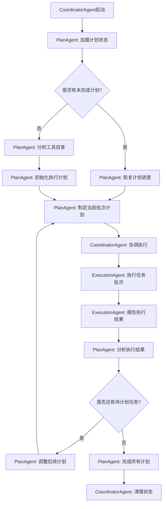
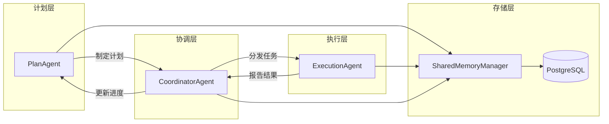

# PlanAgent迭代执行技术方案

## 1. 方案概述

### 1.1 背景问题

* 需要处理大量API工具测试任务，可能超出LLM上下文长度限制

* 需要支持迭代执行：每次制定5个工具任务的执行计划，然后由执行Agent循环执行

* 需要利用PostgreSQL SharedMemoryManager管理计划状态和执行进度

* PlanAgent需要知道上一次计划执行到哪里了，以便制定后续计划

### 1.2 角色定位澄清

* **PlanAgent**：计划制定者和协调者，负责分析工具目录、制定分批执行计划、监控进度、调整计划

* **ExecutionAgent**：任务执行者，负责执行具体的API测试任务、报告执行结果

* **CoordinatorAgent**：协调者，负责PlanAgent和ExecutionAgent之间的交互协调

### 1.3 解决方案

设计基于角色分离的迭代执行架构，PlanAgent专注于计划制定和进度监控，ExecutionAgent专注于任务执行，通过PostgreSQL记忆管理计划状态和执行进度。

## 2. 架构设计

### 2.1 整体架构



### 2.2 角色分离架构



### 2.3 核心组件设计

#### 2.3.1 PlanAgent - 计划制定者

负责分析工具目录、制定执行计划、监控进度

```typescript
interface ExecutionPlan {
  planId: string;
  sessionId: string;
  totalTasks: number;
  plannedBatches: TaskBatch[];
  currentBatchIndex: number;
  status: 'planning' | 'executing' | 'completed' | 'failed';
  createdAt: Date;
  updatedAt: Date;
}

interface TaskBatch {
  batchId: string;
  planId: string;
  tasks: ToolTask[];
  priority: number;
  estimatedDuration: number;
  dependencies?: string[]; // 依赖的其他批次ID
  status: 'planned' | 'assigned' | 'executing' | 'completed' | 'failed';
}

class PlanAgent extends BaseAgent {
  async analyzeTasks(tools: ToolCatalog): Promise<ExecutionPlan>
  async createExecutionPlan(tasks: ToolTask[]): Promise<ExecutionPlan>
  async adjustPlan(planId: string, executionResults: BatchResult[]): Promise<ExecutionPlan>
  async monitorProgress(planId: string): Promise<PlanProgress>
}
```

#### 2.3.2 ExecutionAgent - 任务执行者

负责执行具体的API测试任务

```typescript
interface BatchResult {
  batchId: string;
  executedTasks: TaskResult[];
  status: 'completed' | 'partial' | 'failed';
  executionTime: number;
  errors?: ExecutionError[];
  metrics: ExecutionMetrics;
}

class ExecutionAgent extends BaseAgent {
  async executeBatch(batch: TaskBatch): Promise<BatchResult>
  async executeTask(task: ToolTask): Promise<TaskResult>
  async reportProgress(batchId: string, progress: number): Promise<void>
  async handleTaskError(task: ToolTask, error: Error): Promise<TaskResult>
}
```

#### 2.3.3 CoordinatorAgent - 协调者

负责PlanAgent和ExecutionAgent之间的协调

```typescript
interface CoordinationState {
  sessionId: string;
  currentPlan: ExecutionPlan;
  activeExecutions: Map<string, BatchExecution>;
  completedBatches: BatchResult[];
  status: 'coordinating' | 'paused' | 'completed';
}

class CoordinatorAgent extends BaseAgent {
  async startExecution(tools: ToolCatalog): Promise<string> // 返回sessionId
  async coordinateBatch(batch: TaskBatch): Promise<BatchResult>
  async handleExecutionResult(result: BatchResult): Promise<void>
  async pauseExecution(sessionId: string): Promise<void>
  async resumeExecution(sessionId: string): Promise<void>
}
```

## 3. 核心流程设计

### 3.1 计划制定流程（PlanAgent）

1. **工具目录分析**

   * 解析API工具目录JSON

   * 分析工具依赖关系和复杂度

   * 评估任务执行时间和资源需求

2. **执行计划创建**

   * 生成唯一planId和sessionId

   * 按优先级和依赖关系分批任务（默认每批5个）

   * 创建ExecutionPlan记录

   * 保存计划到PostgreSQL记忆中

3. **计划优化**

   * 分析任务间依赖关系

   * 优化批次执行顺序

   * 预估总执行时间

### 3.2 协调执行流程（CoordinatorAgent）

```typescript
async startExecution(tools: ToolCatalog): Promise<string> {
  // 1. 请求PlanAgent制定执行计划
  const executionPlan = await this.planAgent.createExecutionPlan(tools);
  
  // 2. 初始化协调状态
  const coordinationState = await this.initializeCoordination(executionPlan);
  
  // 3. 开始迭代协调执行
  while (coordinationState.status === 'coordinating') {
    const nextBatch = await this.getNextBatch(executionPlan);
    
    if (!nextBatch) {
      // 所有批次已完成
      coordinationState.status = 'completed';
      break;
    }
    
    try {
      // 4. 分发批次给ExecutionAgent
      const batchResult = await this.executionAgent.executeBatch(nextBatch);
      
      // 5. 将结果反馈给PlanAgent
      const updatedPlan = await this.planAgent.adjustPlan(
        executionPlan.planId, 
        [batchResult]
      );
      
      // 6. 更新协调状态
      await this.updateCoordinationState(coordinationState, batchResult);
      
    } catch (error) {
      // 7. 错误处理和计划调整
      await this.handleExecutionError(nextBatch.batchId, error);
      await this.planAgent.adjustPlan(executionPlan.planId, []);
    }
  }
  
  // 8. 完成协调并清理
  return await this.finalizeCoordination(coordinationState);
}
```

### 3.3 任务执行流程（ExecutionAgent）

```typescript
async executeBatch(batch: TaskBatch): Promise<BatchResult> {
  const batchResult: BatchResult = {
    batchId: batch.batchId,
    executedTasks: [],
    status: 'completed',
    executionTime: 0,
    metrics: { successCount: 0, failureCount: 0 }
  };
  
  const startTime = Date.now();
  
  // 1. 并行执行批次内的任务
  for (const task of batch.tasks) {
    try {
      // 2. 执行单个任务
      const taskResult = await this.executeTask(task);
      batchResult.executedTasks.push(taskResult);
      
      // 3. 报告进度
      await this.reportProgress(
        batch.batchId, 
        batchResult.executedTasks.length / batch.tasks.length
      );
      
    } catch (error) {
      // 4. 处理任务错误
      const errorResult = await this.handleTaskError(task, error);
      batchResult.executedTasks.push(errorResult);
      batchResult.metrics.failureCount++;
    }
  }
  
  // 5. 计算执行指标
  batchResult.executionTime = Date.now() - startTime;
  batchResult.metrics.successCount = batchResult.executedTasks.filter(
    t => t.status === 'success'
  ).length;
  
  // 6. 确定批次状态
  if (batchResult.metrics.failureCount === 0) {
    batchResult.status = 'completed';
  } else if (batchResult.metrics.successCount > 0) {
    batchResult.status = 'partial';
  } else {
    batchResult.status = 'failed';
  }
  
  return batchResult;
}
```

### 3.4 计划调整流程（PlanAgent）

```typescript
async adjustPlan(planId: string, executionResults: BatchResult[]): Promise<ExecutionPlan> {
  // 1. 加载当前执行计划
  const currentPlan = await this.loadExecutionPlan(planId);
  
  // 2. 分析执行结果
  const analysis = await this.analyzeExecutionResults(executionResults);
  
  // 3. 根据分析结果调整计划
  if (analysis.hasFailures) {
    // 重新安排失败的任务
    await this.rescheduleFailedTasks(currentPlan, analysis.failedTasks);
  }
  
  if (analysis.performanceBelowExpected) {
    // 调整后续批次大小或优先级
    await this.optimizeBatchSizes(currentPlan, analysis.performanceMetrics);
  }
  
  // 4. 更新计划状态
  currentPlan.updatedAt = new Date();
  await this.saveExecutionPlan(currentPlan);
  
  return currentPlan;
}
```

### 3.5 上下文管理策略

#### 3.5.1 记忆键命名规范

```typescript
const MEMORY_KEYS = {
  EXECUTION_PLAN: `plan_agent:plan:${planId}`,
  COORDINATION_STATE: `coordinator:state:${sessionId}`,
  BATCH_RESULT: `execution:result:${batchId}`,
  PLAN_PROGRESS: `plan_agent:progress:${planId}`,
  EXECUTION_LOG: `execution:log:${sessionId}`
};
```

#### 3.5.2 上下文压缩策略

* PlanAgent只保留计划状态和进度摘要

* ExecutionAgent只保留当前批次的详细信息

* CoordinatorAgent维护全局协调状态

* 历史批次只保留关键指标和错误信息

* 定期清理过期的执行记录

## 4. 状态管理机制

### 4.1 分层状态管理

#### 4.1.1 PlanAgent状态管理

```typescript
class PlanStateManager {
  constructor(private memoryManager: SharedMemoryManager) {}
  
  async saveExecutionPlan(plan: ExecutionPlan): Promise<void> {
    await this.memoryManager.setSharedMemory(
      MEMORY_KEYS.EXECUTION_PLAN,
      JSON.stringify(plan),
      'plan_agent',
      3600 * 24 // 24小时过期
    );
  }
  
  async loadExecutionPlan(planId: string): Promise<ExecutionPlan | null> {
    const planJson = await this.memoryManager.getSharedMemory(
      MEMORY_KEYS.EXECUTION_PLAN,
      'plan_agent'
    );
    return planJson ? JSON.parse(planJson) : null;
  }
  
  async updatePlanProgress(planId: string, progress: PlanProgress): Promise<void> {
    await this.memoryManager.setSharedMemory(
      MEMORY_KEYS.PLAN_PROGRESS,
      JSON.stringify(progress),
      'plan_agent',
      3600 * 12 // 12小时过期
    );
  }
}
```

#### 4.1.2 CoordinatorAgent状态管理

```typescript
class CoordinationStateManager {
  async saveCoordinationState(state: CoordinationState): Promise<void> {
    await this.memoryManager.setSharedMemory(
      MEMORY_KEYS.COORDINATION_STATE,
      JSON.stringify(state),
      'coordinator',
      3600 * 24
    );
  }
  
  async loadCoordinationState(sessionId: string): Promise<CoordinationState | null> {
    const stateJson = await this.memoryManager.getSharedMemory(
      MEMORY_KEYS.COORDINATION_STATE,
      'coordinator'
    );
    return stateJson ? JSON.parse(stateJson) : null;
  }
}
```

#### 4.1.3 ExecutionAgent状态管理

```typescript
class ExecutionStateManager {
  async saveBatchResult(result: BatchResult): Promise<void> {
    await this.memoryManager.setSharedMemory(
      MEMORY_KEYS.BATCH_RESULT,
      JSON.stringify(result),
      'execution_agent',
      3600 * 6 // 6小时过期
    );
  }
  
  async getBatchResult(batchId: string): Promise<BatchResult | null> {
    const resultJson = await this.memoryManager.getSharedMemory(
      MEMORY_KEYS.BATCH_RESULT,
      'execution_agent'
    );
    return resultJson ? JSON.parse(resultJson) : null;
  }
}
```

### 4.2 进度跟踪机制

```typescript
interface PlanProgress {
  planId: string;
  totalBatches: number;
  completedBatches: number;
  failedBatches: number;
  currentBatchIndex: number;
  estimatedTimeRemaining: number;
  overallSuccessRate: number;
  lastUpdated: Date;
}

interface BatchExecution {
  batchId: string;
  status: 'assigned' | 'executing' | 'completed' | 'failed';
  assignedAt: Date;
  startedAt?: Date;
  completedAt?: Date;
  progress: number; // 0-1
  executionAgent: string;
}
```

## 5. 错误处理和恢复机制

### 5.1 错误分类

1. **批次执行错误**

   * 单个工具调用失败

   * 网络超时

   * API限流

2. **系统级错误**

   * 内存不足

   * 数据库连接失败

   * 进程崩溃

### 5.2 恢复策略

```typescript
async recoverFromFailure(sessionId: string): Promise<void> {
  const executionState = await this.loadExecutionState(sessionId);
  
  if (executionState?.status === 'failed') {
    // 1. 分析失败原因
    const failureAnalysis = await this.analyzeFailure(executionState);
    
    // 2. 决定恢复策略
    if (failureAnalysis.isRecoverable) {
      // 重置状态为运行中
      executionState.status = 'running';
      
      // 重新执行失败的批次
      const failedBatch = await this.getFailedBatch(executionState);
      if (failedBatch) {
        await this.retryBatch(failedBatch);
      }
    } else {
      // 不可恢复，清理状态
      await this.cleanupExecution(sessionId);
    }
  }
}
```

### 5.3 重试机制

```typescript
class BatchRetryManager {
  private maxRetries = 3;
  private retryDelay = 1000; // 1秒
  
  async retryBatch(batch: TaskBatch): Promise<TaskResult[]> {
    let attempt = 0;
    
    while (attempt < this.maxRetries) {
      try {
        return await this.executeBatch(batch);
      } catch (error) {
        attempt++;
        if (attempt >= this.maxRetries) {
          throw error;
        }
        
        // 指数退避
        await this.delay(this.retryDelay * Math.pow(2, attempt));
      }
    }
  }
}
```

## 6. 实现方案

### 6.1 核心类设计

```typescript
// 1. 增强PlanAgent - 专注于计划制定
class PlanAgent extends BaseAgent {
  private planStateManager: PlanStateManager;
  private taskAnalyzer: TaskAnalyzer;
  
  constructor(config: AgentConfig) {
    super(config);
    this.planStateManager = new PlanStateManager(this.sharedMemoryManager);
    this.taskAnalyzer = new TaskAnalyzer();
  }
  
  async createExecutionPlan(tools: ToolCatalog): Promise<ExecutionPlan> {
    // 分析工具目录，制定执行计划
  }
  
  async adjustPlan(planId: string, results: BatchResult[]): Promise<ExecutionPlan> {
    // 根据执行结果调整计划
  }
  
  async monitorProgress(planId: string): Promise<PlanProgress> {
    // 监控计划执行进度
  }
}

// 2. 新增ExecutionAgent - 专注于任务执行
class ExecutionAgent extends BaseAgent {
  private executionStateManager: ExecutionStateManager;
  private taskExecutor: TaskExecutor;
  private retryManager: RetryManager;
  
  constructor(config: AgentConfig) {
    super(config);
    this.executionStateManager = new ExecutionStateManager(this.sharedMemoryManager);
    this.taskExecutor = new TaskExecutor();
    this.retryManager = new RetryManager();
  }
  
  async executeBatch(batch: TaskBatch): Promise<BatchResult> {
    // 执行批次任务
  }
  
  async executeTask(task: ToolTask): Promise<TaskResult> {
    // 执行单个任务
  }
}

// 3. 新增CoordinatorAgent - 专注于协调
class CoordinatorAgent extends BaseAgent {
  private coordinationStateManager: CoordinationStateManager;
  private planAgent: PlanAgent;
  private executionAgent: ExecutionAgent;
  
  constructor(config: AgentConfig, planAgent: PlanAgent, executionAgent: ExecutionAgent) {
    super(config);
    this.coordinationStateManager = new CoordinationStateManager(this.sharedMemoryManager);
    this.planAgent = planAgent;
    this.executionAgent = executionAgent;
  }
  
  async startExecution(tools: ToolCatalog): Promise<string> {
    // 启动协调执行流程
  }
  
  async coordinateBatch(batch: TaskBatch): Promise<BatchResult> {
    // 协调批次执行
  }
}
```

### 6.2 集成到现有架构

1. **修改AgentManager**

   * 注册三个新的Agent类型：PlanAgent、ExecutionAgent、CoordinatorAgent

   * 支持Agent间的依赖注入和协作

   * 添加长时间运行任务的生命周期管理

2. **扩展MultiAgentCoordinator**

   * 集成CoordinatorAgent作为主要的协调入口

   * 支持分层执行模式：计划层 -> 协调层 -> 执行层

   * 添加跨Agent的状态同步机制

3. **增强SharedMemoryManager**

   * 添加命名空间支持，区分不同Agent的数据

   * 优化大数据存储和检索性能

   * 支持数据过期和自动清理机制

### 6.3 Agent间通信机制

```typescript
interface AgentMessage {
  from: string; // 发送方Agent ID
  to: string;   // 接收方Agent ID
  type: 'plan_request' | 'execution_request' | 'result_report' | 'status_update';
  payload: any;
  timestamp: Date;
  correlationId: string; // 用于关联请求和响应
}

class AgentCommunicationManager {
  async sendMessage(message: AgentMessage): Promise<void>
  async receiveMessage(agentId: string): Promise<AgentMessage[]>
  async requestResponse(request: AgentMessage, timeout: number): Promise<AgentMessage>
}
```

## 7. 性能优化

### 7.1 内存优化

* 流式处理大型工具目录

* 及时清理已完成批次的详细数据

* 使用压缩存储执行日志

### 7.2 数据库优化

* 为执行状态表添加索引

* 使用连接池管理数据库连接

* 定期清理过期的执行记录

### 7.3 并发控制

* 支持批次内任务并行执行

* 限制并发数量避免资源耗尽

* 使用队列管理任务调度

## 8. 监控和日志

### 8.1 执行监控

```typescript
interface ExecutionMetrics {
  sessionId: string;
  totalBatches: number;
  completedBatches: number;
  failedBatches: number;
  averageBatchTime: number;
  totalExecutionTime: number;
  errorRate: number;
}
```

### 8.2 日志记录

* 详细的执行日志

* 错误堆栈跟踪

* 性能指标记录

* 用户操作审计

## 9. 部署和配置

### 9.1 环境配置

```typescript
interface IterativeConfig {
  batchSize: number; // 默认5
  maxRetries: number; // 默认3
  retryDelay: number; // 默认1000ms
  executionTimeout: number; // 默认30分钟
  memoryRetention: number; // 默认24小时
}
```

### 9.2 数据库迁移

```sql
-- 执行状态表
CREATE TABLE plan_agent_executions (
  session_id UUID PRIMARY KEY,
  status VARCHAR(20) NOT NULL,
  total_tasks INTEGER NOT NULL,
  completed_batches INTEGER DEFAULT 0,
  created_at TIMESTAMP DEFAULT NOW(),
  updated_at TIMESTAMP DEFAULT NOW()
);

-- 批次信息表
CREATE TABLE plan_agent_batches (
  batch_id UUID PRIMARY KEY,
  session_id UUID REFERENCES plan_agent_executions(session_id),
  status VARCHAR(20) NOT NULL,
  task_count INTEGER NOT NULL,
  created_at TIMESTAMP DEFAULT NOW(),
  completed_at TIMESTAMP
);
```

## 10. 实施建议

### 10.1 分阶段实施

**第一阶段：基础架构**

* 实现三个核心Agent类：PlanAgent、ExecutionAgent、CoordinatorAgent

* 建立Agent间通信机制

* 完善状态管理和持久化

**第二阶段：核心功能**

* 实现计划制定和任务分批逻辑

* 开发任务执行和结果报告功能

* 建立协调和监控机制

**第三阶段：优化增强**

* 添加错误处理和恢复机制

* 实现性能优化和监控

* 完善日志和调试功能

### 10.2 测试策略

1. **单元测试**：每个Agent的核心功能
2. **集成测试**：Agent间协作和通信
3. **端到端测试**：完整的迭代执行流程
4. **压力测试**：大量任务的处理能力
5. **故障测试**：错误恢复和容错能力

## 11. 总结

该重新设计的技术方案通过**角色分离**的架构解决了大量工具任务的迭代执行问题：

### 11.1 核心优势

1. **职责清晰**：PlanAgent专注计划制定，ExecutionAgent专注任务执行，CoordinatorAgent负责协调
2. **可扩展性**：每个Agent可以独立扩展和优化，支持水平扩展
3. **容错性强**：分层架构提供多级错误处理和恢复机制
4. **状态管理**：利用PostgreSQL记忆功能实现可靠的状态持久化
5. **监控完善**：全方位的执行监控和进度跟踪

### 11.2 解决的核心问题

* ✅ **上下文限制**：通过分批执行和状态持久化解决

* ✅ **角色混淆**：明确区分计划制定和任务执行职责

* ✅ **协调复杂**：专门的CoordinatorAgent处理Agent间协作

* ✅ **状态管理**：分层的状态管理机制确保数据一致性

* ✅ **错误恢复**：完善的错误处理和重试机制

该方案完全基于现有的BaseAgent和SharedMemoryManager架构，具有良好的可扩展性和维护性，为大规模API工具测试提供了可靠的技术基础。
