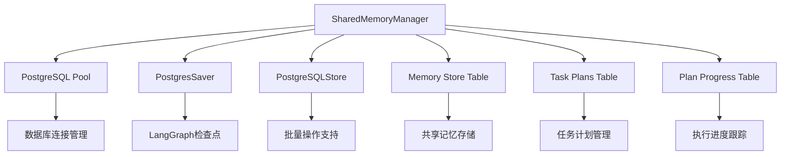
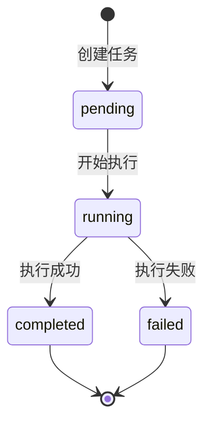
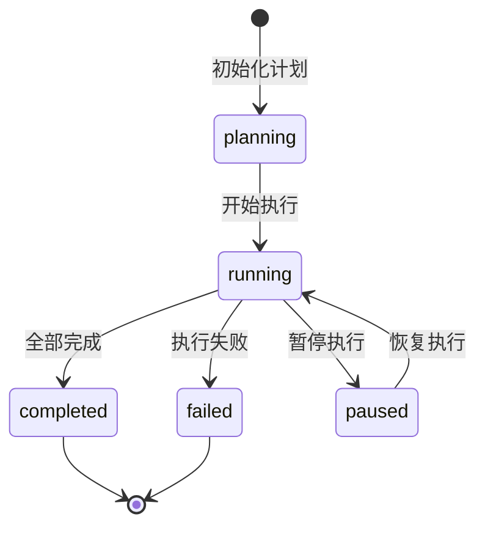

# SharedMemoryManager在PlanAgent中的使用指南

## 1. 架构概述

### 1.1 SharedMemoryManager架构

`SharedMemoryManager` 是一个基于PostgreSQL的共享内存管理系统，为多Agent协作提供持久化存储和状态管理功能。它主要包含以下核心组件：



### 1.2 核心功能模块

- **共享记忆管理**: 支持命名空间隔离的键值存储
- **任务计划管理**: TaskPlan的CRUD操作和批量处理
- **进度跟踪**: PlanProgress的状态管理和统计分析
- **事务支持**: 确保数据一致性的事务操作
- **LangGraph集成**: 提供检查点和存储器支持

## 2. 在PlanAgent中的集成方式

### 2.1 初始化过程

`PlanAgent` 通过继承 `BaseAgent` 获得 `SharedMemoryManager` 实例：

```typescript
// BaseAgent.ts
export abstract class BaseAgent {
  protected memoryManager: SharedMemoryManager;
  
  constructor(config: AgentConfig) {
    this.config = config;
    this.memoryManager = config.memoryManager; // 从配置中获取
    this.graph = this.buildGraph();
  }
}

// PlanAgent.ts
export class PlanAgent extends BaseAgent {
  constructor(config: AgentConfig) {
    super(config); // 自动获得memoryManager实例
  }
}
```

### 2.2 AgentManager中的初始化

```typescript
// AgentManager.ts
export class MultiAgentCoordinator {
  public initializeAgents(): any {
    const planAgent = new PlanAgent({
      agentId: 'plan-agent-001',
      agentType: 'planAgent',
      namespace: this.namespace,
      memoryManager: this.memoryManager // 传递SharedMemoryManager实例
    });
  }
}
```

## 3. 数据模型详解

### 3.1 TaskPlanedForTest 接口

```typescript
export interface TaskPlanedForTest {
  batchIndex: number;                    // 批次索引，用于分批执行
  taskId: string;                        // 唯一任务标识符
  toolName: string;                      // 工具名称
  description: string;                   // 任务描述
  parameters: Record<string, any> | string; // 任务参数
  complexity: 'low' | 'medium' | 'high'; // 复杂度等级
  isRequiredValidateByDatabase: boolean;  // 是否需要数据库验证
}
```

### 3.2 PlanProgress 接口

```typescript
export interface PlanProgress {
  planId: string;           // 计划ID（通常使用thread_id）
  totalBatches: number;     // 总批次数
  completedBatches: number; // 已完成批次数
  failedBatches: number;    // 失败批次数
  currentBatchIndex: number; // 当前批次索引
  overallSuccessRate: number; // 总体成功率
  lastUpdated: Date;        // 最后更新时间
}
```

### 3.3 数据库表结构

#### task_plans 表
```sql
CREATE TABLE task_plans (
  id UUID PRIMARY KEY DEFAULT gen_random_uuid(),
  plan_id VARCHAR(255) NOT NULL,
  batch_index INTEGER NOT NULL,
  task_id VARCHAR(255) NOT NULL UNIQUE,
  tool_name VARCHAR(255) NOT NULL,
  description TEXT,
  parameters JSONB,
  complexity VARCHAR(20) CHECK (complexity IN ('low', 'medium', 'high')),
  is_required_validate_by_database BOOLEAN DEFAULT false,
  status VARCHAR(20) DEFAULT 'pending',
  result JSONB,
  error_message TEXT,
  created_at TIMESTAMP WITH TIME ZONE DEFAULT NOW(),
  updated_at TIMESTAMP WITH TIME ZONE DEFAULT NOW()
);
```

#### plan_progress 表
```sql
CREATE TABLE plan_progress (
  id UUID PRIMARY KEY DEFAULT gen_random_uuid(),
  plan_id VARCHAR(255) NOT NULL UNIQUE,
  total_batches INTEGER NOT NULL DEFAULT 0,
  completed_batches INTEGER NOT NULL DEFAULT 0,
  failed_batches INTEGER NOT NULL DEFAULT 0,
  current_batch_index INTEGER NOT NULL DEFAULT 0,
  overall_success_rate DECIMAL(5,2) DEFAULT 0.00,
  status VARCHAR(20) DEFAULT 'planning',
  created_at TIMESTAMP WITH TIME ZONE DEFAULT NOW(),
  last_updated TIMESTAMP WITH TIME ZONE DEFAULT NOW()
);
```

## 4. API调用方法和代码示例

### 4.1 任务计划管理

#### 保存任务计划
```typescript
// 单个任务保存
await this.memoryManager.saveTaskPlan(planId, task);

// 批量任务保存（推荐）
await this.memoryManager.saveTaskPlans(threadId, tasks);
console.log(`[PlanAgent] Saved ${tasks.length} tasks for plan ${threadId}`);
```

#### 获取任务计划
```typescript
// 获取单个任务
const task = await this.memoryManager.getTaskPlan(taskId);

// 获取批次任务
const batchTasks = await this.memoryManager.getTaskPlansByBatch(planId, batchIndex);

// 获取计划的所有任务
const allTasks = await this.memoryManager.getTaskPlansByPlan(planId);
```

#### 更新任务状态
```typescript
// 更新为运行中
await this.memoryManager.updateTaskPlanStatus(task.taskId, 'running');

// 更新为完成（带结果）
await this.memoryManager.updateTaskPlanStatus(task.taskId, 'completed', result);

// 更新为失败（带错误信息）
await this.memoryManager.updateTaskPlanStatus(
  task.taskId,
  'failed',
  null,
  error instanceof Error ? error.message : String(error)
);
```

### 4.2 进度管理

#### 初始化进度
```typescript
const existingProgress = await this.memoryManager.getPlanProgress(threadId);
if (!existingProgress) {
  const totalBatches = Math.max(...tasks.map(t => t.batchIndex)) + 1;
  const progress: PlanProgress = {
    planId: threadId,
    totalBatches,
    completedBatches: 0,
    failedBatches: 0,
    currentBatchIndex: 0,
    overallSuccessRate: 0,
    lastUpdated: new Date()
  };
  await this.memoryManager.savePlanProgress(progress);
}
```

#### 更新进度
```typescript
// 更新当前批次索引
await this.memoryManager.updateCurrentBatchIndex(planId, batchIndex);

// 增加完成批次数
await this.memoryManager.incrementCompletedBatches(planId);

// 增加失败批次数
await this.memoryManager.incrementFailedBatches(planId);

// 计算并更新成功率
const successRate = await this.memoryManager.calculateSuccessRate(planId);
await this.memoryManager.updatePlanProgress(planId, {
  overallSuccessRate: successRate,
  lastUpdated: new Date()
});
```

### 4.3 共享记忆管理

#### 存储和获取共享记忆
```typescript
// 定义命名空间
const namespace: MemoryNamespace = {
  project: 'automate',
  environment: 'development',
  agent_type: 'plan-agent',
  session_id: threadId
};

// 存储记忆
await this.memoryManager.setSharedMemory(
  namespace,
  'current_plan_status',
  { status: 'executing', progress: 0.5 },
  { expiresIn: 3600 } // 1小时后过期
);

// 获取记忆
const memory = await this.memoryManager.getSharedMemory(namespace, 'current_plan_status');
if (memory) {
  console.log('Current plan status:', memory.value);
}
```

## 5. PlanAgent中的完整使用流程

### 5.1 执行计划的完整流程

```typescript
/**
 * PlanAgent中的executePlan方法展示了完整的使用流程
 */
async executePlan(threadId: string, tasks: TaskPlanedForTest[]): Promise<void> {
  console.log(`[PlanAgent] Starting plan execution for thread: ${threadId}`);

  try {
    // 1. 保存任务计划到数据库
    await this.memoryManager.saveTaskPlans(threadId, tasks);
    console.log(`[PlanAgent] Saved ${tasks.length} tasks for plan ${threadId}`);

    // 2. 初始化进度跟踪
    const existingProgress = await this.memoryManager.getPlanProgress(threadId);
    if (!existingProgress) {
      const totalBatches = Math.max(...tasks.map(t => t.batchIndex)) + 1;
      const progress: PlanProgress = {
        planId: threadId,
        totalBatches,
        completedBatches: 0,
        failedBatches: 0,
        currentBatchIndex: 0,
        overallSuccessRate: 0,
        lastUpdated: new Date()
      };
      await this.memoryManager.savePlanProgress(progress);
    }

    // 3. 按批次执行任务
    const batches = this.groupTasksByBatch(tasks);
    for (const [batchIndex, batchTasks] of batches) {
      await this.executeBatch(threadId, batchIndex, batchTasks);
    }

    console.log(`[PlanAgent] Plan execution completed for thread: ${threadId}`);
  } catch (error) {
    console.error(`[PlanAgent] Error executing plan ${threadId}:`, error);
    throw error;
  }
}
```

### 5.2 批次执行流程

```typescript
private async executeBatch(
  planId: string,
  batchIndex: number,
  tasks: TaskPlanedForTest[]
): Promise<void> {
  try {
    // 更新当前批次索引
    await this.memoryManager.updateCurrentBatchIndex(planId, batchIndex);

    let batchSuccess = true;

    // 执行批次中的每个任务
    for (const task of tasks) {
      try {
        // 更新任务状态为运行中
        await this.memoryManager.updateTaskPlanStatus(task.taskId, 'running');

        // 执行任务
        const result = await this.executeTask(task);

        // 更新任务状态为完成
        await this.memoryManager.updateTaskPlanStatus(task.taskId, 'completed', result);
      } catch (error) {
        // 更新任务状态为失败
        await this.memoryManager.updateTaskPlanStatus(
          task.taskId,
          'failed',
          null,
          error instanceof Error ? error.message : String(error)
        );
        batchSuccess = false;
      }
    }

    // 更新批次完成状态
    if (batchSuccess) {
      await this.memoryManager.incrementCompletedBatches(planId);
    } else {
      await this.memoryManager.incrementFailedBatches(planId);
    }

    // 重新计算成功率
    const successRate = await this.memoryManager.calculateSuccessRate(planId);
    await this.memoryManager.updatePlanProgress(planId, {
      overallSuccessRate: successRate,
      lastUpdated: new Date()
    });
  } catch (error) {
    console.error(`[PlanAgent] Error executing batch ${batchIndex}:`, error);
    throw error;
  }
}
```

## 6. 状态管理和数据持久化

### 6.1 任务状态生命周期



### 6.2 计划进度状态管理



### 6.3 数据持久化机制

- **事务支持**: 批量操作使用数据库事务确保一致性
- **索引优化**: 为常用查询字段创建索引提升性能
- **自动时间戳**: 创建和更新时间自动维护
- **约束检查**: 使用数据库约束确保数据完整性

## 7. 错误处理和最佳实践

### 7.1 错误处理策略

```typescript
// 1. 数据库连接错误处理
try {
  await this.memoryManager.saveTaskPlans(threadId, tasks);
} catch (error) {
  console.error('[PlanAgent] Database error:', error);
  // 实现重试逻辑或降级处理
  throw new Error(`Failed to save tasks: ${error.message}`);
}

// 2. 任务执行错误处理
try {
  const result = await this.executeTask(task);
  await this.memoryManager.updateTaskPlanStatus(task.taskId, 'completed', result);
} catch (error) {
  // 记录详细错误信息
  await this.memoryManager.updateTaskPlanStatus(
    task.taskId,
    'failed',
    null,
    error instanceof Error ? error.message : String(error)
  );
  // 决定是否继续执行其他任务
}
```

### 7.2 最佳实践

#### 性能优化
```typescript
// 1. 使用批量操作
// ❌ 避免循环中的单个操作
for (const task of tasks) {
  await this.memoryManager.saveTaskPlan(planId, task);
}

// ✅ 使用批量操作
await this.memoryManager.saveTaskPlans(planId, tasks);

// 2. 合理使用事务
try {
  await client.query('BEGIN');
  // 批量操作
  await client.query('COMMIT');
} catch (error) {
  await client.query('ROLLBACK');
  throw error;
}
```

#### 内存管理
```typescript
// 1. 及时释放数据库连接
const client = await this.pool.connect();
try {
  // 数据库操作
} finally {
  client.release(); // 确保连接被释放
}

// 2. 清理过期数据
setInterval(async () => {
  const cleanedCount = await this.memoryManager.cleanupExpiredMemories();
  console.log(`Cleaned ${cleanedCount} expired memories`);
}, 60000); // 每分钟清理一次
```

#### 数据一致性
```typescript
// 1. 使用唯一约束防止重复
// task_id 字段设置为 UNIQUE

// 2. 使用 ON CONFLICT 处理冲突
INSERT INTO task_plans (...) VALUES (...)
ON CONFLICT (task_id) 
DO UPDATE SET 
  updated_at = NOW(),
  status = EXCLUDED.status;
```

## 8. 与现有记忆系统的集成

### 8.1 LangGraph集成

```typescript
// 获取检查点保存器
const checkpointer = this.memoryManager.getCheckpointer();

// 在图编译时使用
const graph = workflow.compile({
  checkpointer: checkpointer,
  interruptBefore: ["plan-node"]
});

// 获取存储器
const store = this.memoryManager.getStore();
```

### 8.2 命名空间隔离

```typescript
// 不同Agent使用不同的命名空间
const planAgentNamespace: MemoryNamespace = {
  project: 'automate',
  environment: 'development',
  agent_type: 'plan-agent',
  session_id: threadId
};

const testAgentNamespace: MemoryNamespace = {
  project: 'automate',
  environment: 'development',
  agent_type: 'test-agent',
  session_id: threadId
};
```

### 8.3 跨Agent数据共享

```typescript
// PlanAgent存储执行状态
await this.memoryManager.setSharedMemory(
  planAgentNamespace,
  'execution_status',
  { currentBatch: 2, totalBatches: 5 }
);

// TestAgent读取执行状态
const status = await this.memoryManager.getSharedMemory(
  planAgentNamespace,
  'execution_status'
);
```

## 9. 实际使用场景和示例

### 9.1 场景1：大型测试计划执行

```typescript
// 创建包含多个批次的测试计划
const testTasks: TaskPlanedForTest[] = [
  // 第一批次：环境准备
  {
    batchIndex: 0,
    taskId: 'setup-env-001',
    toolName: 'environment_setup',
    description: '初始化测试环境',
    parameters: { environment: 'staging' },
    complexity: 'medium',
    isRequiredValidateByDatabase: true
  },
  // 第二批次：单元测试
  {
    batchIndex: 1,
    taskId: 'unit-test-001',
    toolName: 'run_tests',
    description: '执行单元测试',
    parameters: { testSuite: 'unit', parallel: true },
    complexity: 'low',
    isRequiredValidateByDatabase: false
  },
  // 第三批次：集成测试
  {
    batchIndex: 2,
    taskId: 'integration-test-001',
    toolName: 'run_tests',
    description: '执行集成测试',
    parameters: { testSuite: 'integration', timeout: 300 },
    complexity: 'high',
    isRequiredValidateByDatabase: true
  }
];

// 执行计划
const threadId = 'test-plan-' + Date.now();
await planAgent.executePlan(threadId, testTasks);

// 监控进度
const progress = await planAgent.getPlanProgress(threadId);
console.log(`Progress: ${progress.completedBatches}/${progress.totalBatches} batches completed`);
console.log(`Success rate: ${progress.overallSuccessRate}%`);
```

### 9.2 场景2：失败任务重试机制

```typescript
// 获取失败的任务
const failedTasks = await this.memoryManager.getTaskPlansByPlan(planId)
  .then(tasks => tasks.filter(task => 
    // 需要从数据库查询状态，这里简化处理
    task.status === 'failed'
  ));

// 重置失败任务状态并重新执行
for (const task of failedTasks) {
  await this.memoryManager.updateTaskPlanStatus(task.taskId, 'pending');
}

// 重新执行失败的批次
const failedBatches = new Set(failedTasks.map(t => t.batchIndex));
for (const batchIndex of failedBatches) {
  const batchTasks = await this.memoryManager.getTaskPlansByBatch(planId, batchIndex);
  await this.executeBatch(planId, batchIndex, batchTasks);
}
```

### 9.3 场景3：动态任务调整

```typescript
// 在执行过程中动态添加任务
const newTask: TaskPlanedForTest = {
  batchIndex: 3, // 新的批次
  taskId: 'dynamic-task-001',
  toolName: 'cleanup',
  description: '清理临时文件',
  parameters: { path: '/tmp/test-data' },
  complexity: 'low',
  isRequiredValidateByDatabase: false
};

// 保存新任务
await this.memoryManager.saveTaskPlan(planId, newTask);

// 更新总批次数
const progress = await this.memoryManager.getPlanProgress(planId);
if (progress && newTask.batchIndex >= progress.totalBatches) {
  await this.memoryManager.updatePlanProgress(planId, {
    totalBatches: newTask.batchIndex + 1,
    lastUpdated: new Date()
  });
}
```

## 10. 监控和调试

### 10.1 日志记录

```typescript
// 在关键操作点添加日志
console.log(`[PlanAgent] Starting plan execution for thread: ${threadId}`);
console.log(`[PlanAgent] Saved ${tasks.length} tasks for plan ${threadId}`);
console.log(`[PlanAgent] Executing batch ${batchIndex} with ${tasks.length} tasks`);
console.log(`[PlanAgent] Task ${task.taskId} completed successfully`);
```

### 10.2 性能监控

```typescript
// 监控数据库操作性能
const startTime = Date.now();
await this.memoryManager.saveTaskPlans(threadId, tasks);
const duration = Date.now() - startTime;
console.log(`[Performance] saveTaskPlans took ${duration}ms`);

// 监控内存使用
const memUsage = process.memoryUsage();
console.log(`[Memory] RSS: ${memUsage.rss / 1024 / 1024}MB, Heap: ${memUsage.heapUsed / 1024 / 1024}MB`);
```

### 10.3 数据库查询调试

```sql
-- 查看当前执行状态
SELECT 
  p.plan_id,
  p.total_batches,
  p.completed_batches,
  p.failed_batches,
  p.overall_success_rate,
  COUNT(t.id) as total_tasks,
  COUNT(CASE WHEN t.status = 'completed' THEN 1 END) as completed_tasks,
  COUNT(CASE WHEN t.status = 'failed' THEN 1 END) as failed_tasks
FROM plan_progress p
LEFT JOIN task_plans t ON p.plan_id = t.plan_id
GROUP BY p.plan_id, p.total_batches, p.completed_batches, p.failed_batches, p.overall_success_rate;

-- 查看失败任务详情
SELECT task_id, tool_name, description, error_message, updated_at
FROM task_plans
WHERE status = 'failed'
ORDER BY updated_at DESC;
```

## 11. 总结

`SharedMemoryManager` 在 `PlanAgent` 中提供了完整的任务计划管理和执行跟踪功能，主要优势包括：

1. **数据持久化**: 所有任务和进度信息都持久化存储在PostgreSQL中
2. **批次执行**: 支持任务分批执行，提高执行效率和可控性
3. **状态跟踪**: 实时跟踪任务和计划的执行状态
4. **错误处理**: 完善的错误处理和恢复机制
5. **性能优化**: 批量操作和事务支持确保高性能
6. **扩展性**: 支持动态添加任务和调整执行计划

通过合理使用 `SharedMemoryManager` 的各项功能，`PlanAgent` 能够高效地管理复杂的任务执行流程，为多Agent协作提供可靠的基础设施支持。