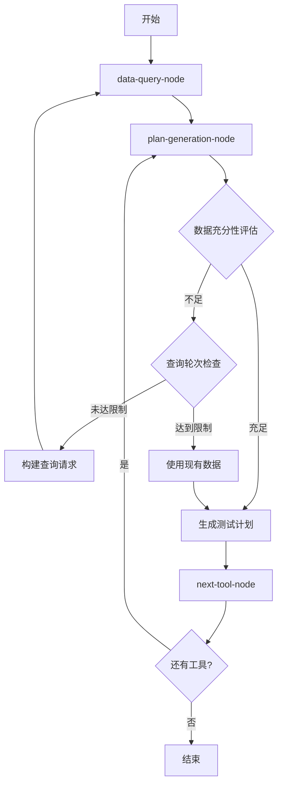

# PlanAgent LLM驱动数据查询架构文档

## 概述

本文档描述了PlanAgent中新实现的LLM驱动数据查询机制，该机制允许LLM在制定测试计划时智能评估数据充分性，并在需要时迭代获取更多数据。

## 核心特性

### 1. LLM驱动的数据充分性评估
- **智能评估**: LLM根据当前工具需求和已有数据，判断信息是否充足
- **缺失数据识别**: 自动识别生成有效测试计划所需的具体数据类型
- **置信度评分**: 提供评估结果的置信度，帮助决策

### 2. 迭代数据查询机制
- **动态查询**: 根据LLM评估结果，动态生成特定的SQL查询
- **多轮查询**: 支持多轮数据获取，直到信息充足或达到限制
- **智能路由**: 自动在plan-generation-node和data-query-node之间路由

### 3. 查询轮次限制
- **防止无限循环**: 设置最大查询轮次（默认3轮）
- **优雅降级**: 达到限制后使用现有数据继续生成计划
- **状态跟踪**: 完整记录查询历史和决策过程

## 架构设计

### 状态管理

```typescript
interface PlanAgentAnnotation {
  // 原有字段...
  
  // 新增的数据查询相关字段
  dataQueryRequest?: {
    needsMoreData: boolean;
    missingData?: string[];
    reason: string;
    confidence: number;
  };
  queryRound?: number;
  dataAssessment?: {
    sufficient: boolean;
    missingData: string[];
    reason: string;
    confidence: number;
  };
  queryHistory?: Array<{
    round: number;
    request: any;
    timestamp: string;
    queriesExecuted: number;
    success: boolean;
  }>;
}
```

### 节点工作流程



## 核心方法详解

### 1. assessDataSufficiency

**功能**: 评估当前数据是否足以生成有效的测试计划

```typescript
private async assessDataSufficiency(
  queryResults: any,
  currentTool: any
): Promise<{
  sufficient: boolean;
  missingData: string[];
  reason: string;
  confidence: number;
}>
```

**工作原理**:
1. 构建包含工具信息和当前数据的评估提示
2. 调用LLM进行智能分析
3. 解析LLM响应，提取评估结果
4. 提供回退机制处理解析失败

### 2. buildSpecificQueries

**功能**: 根据缺失数据类型构建特定的SQL查询

```typescript
private buildSpecificQueries(missingDataTypes: string[]): Array<{
  type: string;
  query: string;
  key: string;
}>
```

**支持的数据类型**:
- `user_data`: 用户相关数据
- `product_data`: 产品相关数据
- `order_data`: 订单相关数据
- `sample_data`: 通用样本数据
- `id_references`: ID引用数据

### 3. 增强的dataQueryNode

**新增功能**:
- 支持基于`dataQueryRequest`的目标查询
- 查询历史记录和轮次跟踪
- 智能查询结果组织

### 4. 增强的routeDecision

**新增逻辑**:
- 优先检查数据查询请求
- 查询轮次限制验证
- 智能路由决策

## 使用示例

### 基本使用流程

1. **初始化**: PlanAgent启动，执行基础数据查询
2. **工具处理**: 设置当前要处理的工具
3. **数据评估**: LLM评估当前数据是否充足
4. **迭代查询**: 如需要，执行特定数据查询
5. **计划生成**: 数据充足后生成测试计划

### 配置参数

```typescript
// 最大查询轮次（在routeDecision中配置）
const maxRounds = 3;

// 数据评估提示模板（在assessDataSufficiency中配置）
const assessmentPrompt = `
分析当前数据是否足以为工具生成有效的测试计划...
`;
```

## 监控和调试

### 日志输出

系统提供详细的日志输出，包括：
- 查询轮次信息
- 数据评估结果
- 特定查询执行状态
- 路由决策过程

### 测试验证

使用提供的测试脚本验证功能：

```bash
# 运行迭代查询功能测试
node test-iterative-query.ts
```

测试覆盖：
- 数据充分性评估
- 迭代查询流程
- 轮次限制机制
- 查询历史跟踪
- 特定查询构建

## 性能考虑

### 优化策略

1. **查询缓存**: 避免重复执行相同查询
2. **轮次限制**: 防止无限循环和资源浪费
3. **智能评估**: 减少不必要的数据查询
4. **批量处理**: 在单次查询中获取多种数据类型

### 资源管理

- **内存使用**: 查询历史和结果适当清理
- **数据库连接**: 复用MCP工具连接
- **LLM调用**: 合理控制评估频率

## 错误处理

### 常见错误场景

1. **数据库连接失败**: 提供详细错误信息和回退机制
2. **LLM评估失败**: 使用默认策略继续处理
3. **查询语法错误**: 记录错误并跳过问题查询
4. **轮次限制达到**: 优雅降级使用现有数据

### 错误恢复

- **自动重试**: 对临时性错误进行重试
- **降级处理**: 在关键错误时使用基础功能
- **状态保护**: 确保系统状态一致性

## 扩展性

### 新数据类型支持

在`buildSpecificQueries`方法中添加新的数据类型处理：

```typescript
case 'new_data_type':
  queries.push({
    type: 'new_data_type',
    query: 'SELECT * FROM new_table LIMIT 10',
    key: 'new_data_type_results'
  });
  break;
```

### 评估策略扩展

可以扩展`assessDataSufficiency`方法以支持：
- 更复杂的评估逻辑
- 多模型评估对比
- 领域特定的评估标准

## 最佳实践

### 开发建议

1. **合理设置轮次限制**: 根据数据复杂度调整最大轮次
2. **优化评估提示**: 提供清晰的评估标准和示例
3. **监控查询性能**: 定期检查查询执行时间
4. **测试边界情况**: 验证各种异常场景的处理

### 部署注意事项

1. **环境配置**: 确保数据库连接和LLM服务可用
2. **权限设置**: 验证数据库查询权限
3. **监控告警**: 设置关键指标监控
4. **日志管理**: 配置适当的日志级别和轮转

## 版本历史

- **v1.0**: 初始实现，支持基础的迭代数据查询
- **v1.1**: 添加查询轮次限制和历史跟踪
- **v1.2**: 优化数据评估逻辑和错误处理

## 相关文件

- `PlanAgent.ts`: 主要实现文件
- `test-iterative-query.ts`: 功能测试脚本
- `StructuredOutputSchema.ts`: 数据结构定义
- `Prompts.ts`: 提示模板定义

---

*本文档随代码更新而维护，如有疑问请参考最新的代码实现。*